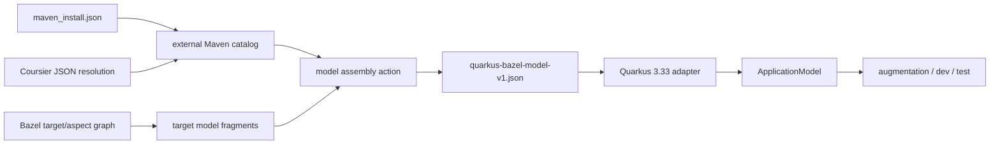
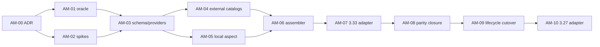

# `ApplicationModel` fidelity battle plan

This is the implementation playbook for replacing `rules_quarkus`' inferred
Quarkus `ApplicationModel` with a model whose material semantics match Quarkus
3.33.2's Maven and Gradle integrations. It expands the release-blocker identified
in [the Quarkus 3.33.2 gap analysis](quarkus-3.33.2-gap-analysis.md).

The intended reader is an engineer who knows Java and Bazel but does not yet
know Quarkus bootstrap internals. Each work package has a bounded outcome,
likely files, tests, and an exit gate. Do not merge the migration as one large
change.

## Implementation status (2026-07-18)

Implemented on the reference branch:

- strict `quarkus-bazel-model-v1` transport, reader, validator, writer, and
  Quarkus 3.33.2/3.27.4 adapters;
- Bazel aspect graph for ordinary Java targets, workspace source/resource and
  output metadata, local runtime/deployment extension modules, and reloadable
  modules;
- lock-authoritative runtime catalog enriched with a pinned Coursier graph and
  descriptor-driven deployment discovery without `-deployment` guessing;
- dependency flags, effective scopes, platform imports/properties,
  capabilities, classloading metadata, removed resources, and extension dev
  configuration;
- shared explicit-model plumbing for normal, dev, test, and native-sources;
- Maven/Gradle/Bazel post-curation snapshot hook, canonical normalizer,
  semantic diff, and exact-value reviewed allowlists;
- generic conditional and conditional-dev dependency activation through a
  mode-aware graph fixpoint, including nested activation and deployment
  injection;
- lifecycle smoke validation, real Dev UI graph assertions, and verified
  multi-module hot reload;
- complete local macOS smoke/root passes on Bazel 7.7.1, 8.7.0, and 9.2.0.

Still required before the release blocker can be closed:

- the existing Linux CI matrix must certify the branch on Bazel 7.x, 8.x, and
  9.x with the repository's Java 17 toolchain.

The migration work packages below are retained as implementation history. The
legacy builder and its CLI rollback have now been deleted; current code has one
fail-closed explicit-model path.

## Decision summary

Build a Bazel-owned, explicit dependency/workspace graph and pass it to a
version-specific Java adapter that creates Quarkus's `ApplicationModel`.

The following scope decisions are confirmed:

- v1 supports arbitrary local `java_library` graphs, not only `@maven` and
  `quarkus_extension_runtime` targets;
- the existing developer-facing APIs and extension DX remain stable:
  `quarkus_app`, `quarkus_test`, and `quarkus_extension_runtime` gain no new
  required application-level attributes for model fidelity;
- application developers continue to declare only the runtime extension target
  (for example `@maven//:io_quarkus_quarkus_rest`); the corresponding
  `-deployment` artifact and classpath remain automatically discovered and
  wired by `rules_quarkus`;
- aspects, graph fragments, catalogs, schema files, and version adapters are
  internal implementation details and must not leak into ordinary BUILD files;
- `QuarkusAppModelBuilder`, its helper methods, current quarkifier model CLI
  inputs, and its inferred-POM pipeline have no compatibility guarantee; they
  may be replaced or rewritten from scratch as long as the public rule APIs and
  observable Quarkus behavior remain compatible;
- custom platforms provide explicit platform BOM metadata through the
  toolchain API, with a compatibility/deprecation cycle for existing users;
- Quarkus 3.33.2 is the reference implementation and ships first; the 3.27.4
  adapter/backport follows after 3.33.2 passes conformance.

The migration used the old builder only as a temporary differential input. It
is no longer a compatibility boundary or emergency runtime fallback.

The durable boundary is a versioned, Quarkus-independent JSON contract. Starlark
describes facts Bazel knows: targets, artifacts, dependency edges, classpath
membership, source sets, and workspace modules. The Java adapter describes
Quarkus semantics: dependency flags, extension metadata, capabilities,
classloading controls, and `ApplicationModelBuilder` API calls.



### Why this boundary

- Bazel analysis has the local target edges that a flattened `JavaInfo`
  classpath loses.
- `maven_install.json` already contains the resolved external runtime graph.
- Coursier can produce the deployment-resolution graph instead of only a list
  of downloaded jars.
- Quarkus's `ApplicationModel.asMap()`/`fromMap()` representation is useful for
  testing, but it is an internal, version-coupled wire format. Starlark should
  not produce it directly.
- A small Java adapter can change per supported Quarkus line without forcing a
  Starlark schema migration.

## Scope and success criteria

### In scope

The first complete implementation targets Quarkus 3.33.2 and covers:

- the application artifact and its exact direct dependencies;
- the effective runtime and deployment dependency graphs;
- full GACTV coordinates, resolved paths, scope, optionality, and exclusions
  where Bazel has an equivalent declaration;
- every non-transient `DependencyFlags` semantic;
- application and dependency `WorkspaceModule` data;
- reloadable workspace dependencies;
- platform BOM imports and platform properties;
- extension capabilities, classloading directives, removed resources, and
  extension dev-mode configuration;
- normal, dev, test, and native-sources augmentation inputs;
- deterministic serialization suitable for remote execution and caching.

The model work must also provide the graph needed by generic conditional and
deployment dependency resolution. Implementing every conditional-dependency
case can be a following workstream, but this design must not make that work
impossible or require another model rewrite.

### Not in scope

- reproducing Maven's POM inheritance or Gradle's configuration engine inside
  Bazel;
- preserving dependencies that Bazel's resolved target graph has eliminated;
- using Maven Resolver during normal Bazel actions;
- modifying Quarkus 3.33.2 sources;
- making `quarkifier` a user-facing CLI;
- solving code generation, packaging formats, or integration tests except where
  their metadata must fit the model contract.

### Release-blocker exit criterion

The blocker is closed only when all of the following hold:

1. For the conformance fixtures, normalized Maven, Gradle, and Bazel models have
   no unexplained differences in the semantic fields listed below.
2. The explicit model is the default for build, dev, test, and native-sources
   modes on Quarkus 3.33.2.
3. Missing coordinates, dangling edges, duplicate GACTV identities, or missing
   artifacts fail analysis or model validation with an actionable error. They
   are never repaired by attaching an orphan to the application root.
4. Dev UI displays the real dependency graph rather than a flattened list.
5. Multi-module reload and at least one local extension work from declared
   workspace metadata, without Maven-directory guessing.
6. Bazel 7.7.1, 8.x, and 9.x conformance tests pass on the supported JDKs.
7. The legacy builder can be disabled without changing the normalized model or
   application behavior for the certified fixture matrix.
8. Existing supported `quarkus_app` and `quarkus_test` BUILD declarations build
   unchanged; no deployment extension dependency becomes a user responsibility.

### Public API and DX compatibility invariant

The model rewrite is an internal implementation change. For existing supported
projects, this remains the application-author workflow:

```starlark
java_library(
    name = "lib",
    srcs = glob(["src/main/java/**/*.java"]),
    deps = ["@maven//:io_quarkus_quarkus_rest"],
)

quarkus_app(
    name = "app",
    deps = [":lib"],
)
```

Developers must not add `quarkus-rest-deployment`, model files, graph targets,
aspects, or provider wrappers. `quarkus_test` must retain the same principle.
New optional attributes are allowed only for genuinely new capabilities or
advanced custom-rule integration; they cannot be required to preserve behavior
that works today.

Standard Quarkus platform use should also retain a zero-configuration default.
The explicit platform metadata requirement applies when users select custom or
multiple BOMs, where automatic inference would be ambiguous.

## Historical failure anatomy

The replaced path started with transitive runtime jars, deployment jars, and a
list of guessed local application jars. `QuarkusAppModelBuilder` then derives
coordinates and graph structure from jar paths, `pom.properties`, embedded
POMs, and extension metadata.

| Current behavior | Information lost or invented | Consequence |
|---|---|---|
| `collect_runtime_classpath()` flattens `JavaInfo.transitive_runtime_jars` | Target edges and edge kinds | Direct/transitive flags cannot be recovered |
| `collect_local_app_jars()` identifies local outputs heuristically | Module identity, source sets, resources, build outputs | Incomplete workspace and reload model |
| `computeRootEdges()` attaches extension runtime/deployment artifacts to the root | True parent-child relationships | Incorrect Dev UI graph and top-level flags |
| Embedded POM parsing wires subdependencies | Effective conflict resolution, exclusions, full property interpolation, profiles, scopes | Graph may differ from Bazel's selected graph |
| `adoptOrphans()` and `adoptDeploymentOrphans()` force unlinked nodes into the model | Missing input is hidden | False graph looks valid |
| Empty `PlatformImportsImpl` is installed to satisfy serialization | Imported BOMs, release alignment, platform properties | Platform-aware behavior and diagnostics differ |
| Flags are reconstructed from path membership and guesses | Optional, compile-only, top-level extension, workspace/reloadable semantics | Classloading and extension behavior can differ |

The replacement must delete the need for `computeRootEdges()`,
`wireSubDependencies()`, both orphan-adoption paths, and the embedded POM parser
on the explicit path. Those inference functions and the legacy path have now
been removed.

## Semantic parity contract

The conformance normalizer must compare these fields. Path roots and ordering
are normalized; meaning is not.

### Application

- GACTV coordinates;
- resolved artifact path(s);
- workspace module;
- main and test source/resource output trees;
- direct dependency IDs in declared order where order is meaningful.

### Every resolved dependency

- GACTV identity and resolved path(s);
- scope and optionality;
- direct dependency IDs;
- workspace module link;
- `DIRECT`;
- `RUNTIME_CP`;
- `DEPLOYMENT_CP`;
- `RUNTIME_EXTENSION_ARTIFACT`;
- `TOP_LEVEL_RUNTIME_EXTENSION_ARTIFACT`;
- `WORKSPACE_MODULE`;
- `RELOADABLE`;
- `COMPILE_ONLY`;
- `MISSING_FROM_APPLICATION` when deliberately represented;
- `CLASSLOADER_PARENT_FIRST`;
- `CLASSLOADER_RUNNER_PARENT_FIRST`;
- `CLASSLOADER_LESSER_PRIORITY`;
- `OPTIONAL`.

`VISITED` is traversal-internal and must be removed by normalization.

### Model-level metadata

- imported platform BOMs and platform properties;
- capability contracts;
- parent-first, runner-parent-first, lower-priority, and excluded artifacts;
- removed resources;
- reloadable workspace dependency keys;
- application/workspace modules and their parent/direct-dependency structure;
- extension dev-mode JVM options and locks.

### Intentional Bazel differences

The golden tests need an allowlist file, reviewed like code. Initial candidates
are limited to:

- build directory names and absolute path roots;
- Bazel-generated application coordinates, if the user did not declare them;
- Maven/Gradle build-file paths versus Bazel BUILD/MODULE files;
- dependency order when Quarkus treats the collection as a set.

Do not allowlist missing nodes, missing edges, flags, source sets, platform
metadata, capabilities, or removed resources.

## The `quarkus-bazel-model-v1` contract

The schema is a transport contract, not a copy of Quarkus's Java classes. Put
its JSON Schema and examples under `quarkifier/src/main/resources/model/` and
document changes in this file.

### Top-level shape

```json
{
  "schemaVersion": 1,
  "producer": {"rulesQuarkusVersion": "...", "bazelVersion": "..."},
  "quarkusVersion": "3.33.2",
  "mode": "NORMAL",
  "applicationId": "//app:lib",
  "nodes": [],
  "workspaceModules": [],
  "platform": {},
  "diagnostics": {}
}
```

Required design rules:

- IDs are stable logical IDs, never absolute paths.
- Collections are sorted by ID before serialization.
- All graph edges refer to node IDs; coordinates are attributes, not IDs.
- Paths are execution-root-relative action inputs or declared outputs.
- Unknown fields are rejected within schema version 1. A future producer must
  bump the schema rather than silently changing semantics.
- The producer records facts, not Quarkus numeric flag values.
- A SHA-256 of canonical JSON may be emitted for diagnostics, but must not be
  used as an artifact coordinate.

### Dependency node

Each node should contain at least:

```json
{
  "id": "@maven//:io_quarkus_quarkus_rest",
  "kind": "EXTERNAL",
  "coordinates": {
    "groupId": "io.quarkus",
    "artifactId": "quarkus-rest",
    "classifier": "",
    "type": "jar",
    "version": "3.33.2"
  },
  "paths": ["external/maven/.../quarkus-rest-3.33.2.jar"],
  "dependencies": ["..."],
  "edgeSemantics": {
    "directFromApplication": true,
    "runtimeClasspath": true,
    "deploymentClasspath": true,
    "compileOnly": false,
    "optional": false
  },
  "workspaceModuleId": null,
  "bazel": {"label": "@maven//:io_quarkus_quarkus_rest"}
}
```

Use an enum for `kind`: `APPLICATION`, `WORKSPACE`, `EXTERNAL`,
`EXTENSION_RUNTIME`, `EXTENSION_DEPLOYMENT`, or `SYNTHETIC`. Synthetic nodes
must include a reason and are forbidden in release conformance fixtures unless
explicitly allowlisted.

Keep exclusions on the edge that declares them, not as a global property. A
node may have several parents with different exclusions. If schema
simplification is needed, represent dependencies as edge objects from the
start:

```json
{"to": "node-id", "kind": "DEPS", "exclusions": ["g:a"], "optional": false}
```

Supported edge kinds should include `DEPS`, `EXPORTS`, `RUNTIME_DEPS`,
`DEPLOYMENT`, and `CONSTRAINT`. Map Bazel edge semantics in one documented
place; do not scatter the mapping across rules.

### Workspace module

Model the parts of Quarkus `WorkspaceModule` explicitly:

- module ID and GAV;
- Bazel label;
- module directory and build/output directory;
- main/test source directories;
- main/test resource directories;
- generated source/resource directories;
- classes/resources output trees;
- build files (`BUILD`, `BUILD.bazel`, and relevant `.bzl` files);
- parent module ID;
- direct module dependencies and dependency constraints;
- test classpath exclusions and additional elements;
- `reloadable` fact.

Do not infer source roots by looking for `src/main/java` in the Java adapter.
Starlark should use declared source files and provider metadata. A convenience
macro may still populate conventional defaults for users.

### Platform

The platform section must contain:

- imported BOM GACTV coordinates;
- platform descriptor artifacts;
- platform properties artifacts or merged properties;
- release-info properties used by Quarkus alignment checks;
- provenance: toolchain tag, lock entry, or explicit user declaration.

The existing toolchain tag needs an explicit `platform_boms`/platform metadata
input unless it can be derived unambiguously from the dependency resolver's
machine-readable output. Guessing `io.quarkus.platform:quarkus-bom` from the
Quarkus version is not sufficient for custom or multi-BOM platforms.

## Ownership of semantics

| Concern | Owner | Reason |
|---|---|---|
| Local target edges and edge kind | Starlark aspect/provider | Only Bazel analysis sees them accurately |
| External runtime graph and selected versions | Lock-file catalog | It is the resolver's recorded result |
| Deployment graph and selected versions | Coursier JSON report | Current jar-only fetch discards its graph |
| Artifact files | Bazel actions/repository rules | They must be declared inputs |
| Workspace source/resource/output metadata | Starlark provider | It derives from rule attributes and outputs |
| Quarkus flags | Version-specific Java adapter | The meanings are Quarkus API semantics |
| Extension descriptor interpretation | Java adapter/shared extension processor | Avoid implementing Quarkus property syntax in Starlark |
| Canonical ordering and schema validation | Model assembler + Java reader | Deterministic actions and early failures |
| Maven/Gradle equivalence | Conformance normalizer | One comparison language across build tools |

## Work packages

Estimates are focused engineering days for a junior engineer with daily review
from a maintainer. They are planning ranges, not commitments.

### AM-00 — lock decisions and write ADR (0.5–1 day)

Record the confirmed decisions:

1. Quarkus 3.33.2 lands first; 3.27 is a later adapter/backport.
2. Arbitrary local `java_library` graphs are supported, not only
   `quarkus_extension_runtime`.
3. Adding toolchain/platform metadata is permitted with a deprecation window.
4. The explicit model is a versioned internal contract; Quarkus's map
   serialization is only a reference/output format.
5. Current application APIs and runtime-extension-only declarations remain
   source compatible; model fidelity introduces no required BUILD migration.

Likely file: `docs/adr/NNNN-explicit-application-model.md`.

Exit gate: a maintainer approves the ownership table and schema boundary before
production code starts.

### AM-01 — build the conformance oracle (3–5 days)

Create a test-only Quarkus extension with a deployment build step that consumes
`CurateOutcomeBuildItem`, obtains its `ApplicationModel`, and writes a canonical
snapshot. This observes the same post-curation model inside Maven, Gradle, and
Bazel augmentation.

Add a normalizer that:

- uses Quarkus's `asMap()` as an input where available;
- converts flags to names;
- sorts nodes, edges, paths, capabilities, and resource sets;
- replaces fixture-specific absolute roots with `$WORKSPACE`, `$EXECROOT`, and
  `$M2` tokens;
- removes `VISITED` and explicitly approved build-tool-only fields;
- emits a human-readable JSON diff.

Initial fixture matrix:

| Fixture | Required assertion |
|---|---|
| `rest-basic` | direct vs transitive runtime graph |
| `diamond-conflict` | selected version and both parent edges |
| `scope-optional` | provided/compile-only and optional semantics |
| `classifier-type` | non-default classifier/type identity |
| `multi-module` | workspace modules, source/resource sets, reloadable flags |
| `local-extension` | runtime/deployment pair and capability metadata |
| `classloading` | parent-first, runner-parent-first, lower priority, exclusions |
| `conditional-dev` | runtime/deployment activation and top-level flags in dev |
| `platform` | BOMs, properties, release alignment |
| `test-model` | test application artifact and test sources/resources |

Likely locations:

- `e2e/application-model/` for Maven, Gradle, and Bazel fixtures;
- `quarkifier/src/test/java/.../model/normalize/` for normalization;
- `quarkifier/src/test/resources/model/golden/` for expected snapshots.

Exit gate: Maven and Gradle snapshots of equivalent fixtures either match or
have reviewed allowlist entries. At least two deliberate mutations produce an
easy-to-read failing diff.

### AM-02 — dependency-source feasibility spikes (2–4 days)

Do these as throwaway or test-only branches before choosing implementation
details.

#### Spike A: local aspect graph

- Traverse `deps`, `exports`, and `runtime_deps` on ordinary Java rules.
- Capture each target's direct edges, `JavaInfo` outputs, source jars, labels,
  `neverlink`, and source/resource attributes where exposed.
- Verify aspect propagation across generated macros and external repositories
  on Bazel 7.7.1, 8.x, and 9.x.
- Determine whether `rules_jvm_external`'s public `MavenInfo` is present on
  targets without depending on its private `has_maven_deps` aspect. Do not take
  a private `rules_jvm_external` load as the production design.

Expected outcome: use our own aspect for local graph facts and the lock catalog
for external Maven topology. `MavenInfo` may enrich coordinates but must not be
required.

#### Spike B: lock-file graph

- Parse lock version 3 `artifacts`, `dependencies`, `conflict_resolution`, and
  repositories.
- Verify classifier/type keys and file label mapping.
- Fail with a targeted message for unknown lock versions.
- Document absent semantics: scope, optionality, and declaration-site
  exclusions are not fully represented by the resolved lock graph.

#### Spike C: Coursier deployment graph

- Change a test repository rule invocation to request Coursier's JSON report.
- Confirm it records exact GACTV nodes, selected versions, and parent-child
  edges for `quarkus-core-deployment` plus two extensions.
- Confirm copied repository paths can be joined back to graph nodes without
  parsing cache paths.
- If the pinned Coursier CLI cannot emit the required graph, pin a compatible
  command/version or add a tiny resolver reporter; do not fall back to embedded
  POM parsing.

Exit gate: commit a short feasibility report with example JSON and the chosen
source for every required field.

### AM-03 — define providers and schema (3–5 days)

Add Starlark providers, likely in `quarkus/private/providers.bzl`:

- `QuarkusArtifactInfo`: logical ID, GACTV, artifact files, kind;
- `QuarkusDependencyGraphInfo`: direct edge fragments plus transitive fragment
  files;
- `QuarkusWorkspaceModuleInfo`: source/resource/output/build metadata;
- extend `QuarkusExtensionInfo` rather than creating a competing extension
  provider.

These providers are internal implementation APIs. Ordinary application authors
must neither load nor instantiate them.

Provider instances should carry small structs and artifact references, not the
entire transitive graph as a single in-memory Starlark list. Emit one canonical
fragment per target and combine fragments in an action. This avoids large
analysis values and command lines.

Add the JSON Schema, a valid minimal example, and invalid examples for:

- duplicate node ID;
- duplicate GACTV with different files;
- dangling edge;
- missing application node;
- unsupported schema/Quarkus version;
- absolute or undeclared path;
- extension deployment node without a runtime association.

Exit gate: schema tests pass without using Quarkus classes. A reviewer can
answer where every field originates by consulting the ownership table.

### AM-04 — generate the external dependency catalog (4–7 days)

In `quarkus/extensions.bzl`:

1. Parse the provided `maven_install.json` during module-extension/repository
   setup.
2. Emit a canonical runtime catalog containing resolved coordinates and exact
   dependency edges.
3. Make Coursier emit and preserve a canonical deployment graph alongside the
   copied jars.
4. Associate each copied deployment artifact with its catalog node explicitly.
5. Replace group-prefix/name guessing with extension descriptor-declared
   deployment coordinates when that metadata is available. Until the separate
   conditional-resolution work lands, record guessed associations as
   diagnostics and fail them in strict conformance mode.
6. Emit public file targets such as `@rules_quarkus//model:runtime_catalog` and
   `@rules_quarkus//model:deployment_catalog` for consuming actions.

Do not rely on Coursier cache paths after repository setup. The repository owns
copied jars and the graph must point at those stable repository artifacts.

Tests:

- lock v3 parsing, classifier/type, conflict selection, and malformed locks;
- duplicate GAs with classifiers;
- an independently versioned Quarkiverse extension;
- private/custom repository provenance;
- Coursier graph determinism across two clean repository fetches;
- unresolved required deployment artifacts fail closed.

Exit gate: no deployment graph edge is derived from jar filename or embedded
POM. Catalog generation is deterministic and covered on macOS/Linux.

### AM-05 — collect local target and workspace facts (5–8 days)

Add a Quarkus model aspect in `quarkus/private/application_model_aspect.bzl` and
apply it from `quarkus_app`, `quarkus_test`, dev, and native rules.

Required behavior:

- emit one node per local Java target with direct `deps`, `exports`, and
  `runtime_deps` edges;
- distinguish a target's own output jar from transitive jars;
- preserve deterministic target identity even when a target has no Maven GAV;
- use declared coordinates when present and generate namespaced synthetic
  coordinates only when Quarkus requires them;
- map `neverlink`/compile-only semantics in one tested function;
- create workspace-module metadata from declared sources, resources, outputs,
  and BUILD files;
- mark reloadability from a documented rule, initially: reachable local
  workspace modules that are not extension runtime artifacts;
- preserve local extension runtime/deployment pairing from
  `QuarkusExtensionInfo`;
- define a provider contract that authors of custom Java/language rules can
  return when the generic aspect cannot introspect their source metadata.

Do not introduce a required `quarkus_module` wrapper around ordinary targets.
Custom-rule integration is a rule-author concern. A future optional convenience
wrapper may be added for advanced cases, but it is not part of the application
migration and must not appear in standard examples.

Tests:

- ordinary `java_library`, `java_import`, alias, filegroup, exports, runtime
  deps, neverlink, and generated source jar;
- diamond local graph;
- two local modules with the same target name in different packages;
- non-Maven directory layout;
- local extension runtime/deployment modules;
- a custom rule using the override provider;
- analysis tests on Bazel 7/8/9.

Exit gate: a multi-module fixture's fragment graph matches `bazel query` direct
edges and contains no path-layout guesses.

### AM-06 — assemble and validate the per-target model (3–5 days)

Add a small hermetic assembler executable or Starlark action. Prefer a small
Java binary already built with `quarkifier` dependencies if JSON processing in
Starlark becomes awkward.

Inputs:

- runtime catalog;
- deployment catalog;
- target fragment files;
- mode and application identity;
- platform declaration;
- actual runtime/deployment artifact files.

Responsibilities:

- compute the reachable graph for the requested target and mode;
- join external labels/catalog IDs to actual files;
- preserve all parents in diamonds;
- reject missing and ambiguous joins;
- deduplicate by full GACTV, not GA or filename;
- validate every edge and path;
- sort canonical output;
- produce `model.json` and optional `model-diagnostics.json` declared outputs.

Add `--strict` and `--explain <node-id>` to the assembler binary for tests and
support. `--explain` should show provenance, parents, edge kinds, selected
artifact, and why a classpath fact is true.

Wire the output into `run_augmentation()` as a new declared input and
`--application-model=<path>` argument. Keep the old classpath/local-jar inputs
until the migration completes.

Exit gate: model assembly is deterministic under shuffled fragment input and
fails before Quarkus starts for every invalid-schema fixture.

### AM-07 — implement the Quarkus 3.33 adapter (6–10 days)

Implement the 3.33 adapter from the explicit contract. Reusing
`QuarkusAppModelBuilder` code is optional and should happen only where a helper
already has the correct explicit-model semantics. Do not preserve its class
shape or inference pipeline for compatibility.

During rollout, create the new path alongside the legacy builder, for example:

- `model/BazelApplicationModelReader.java` — parse and validate schema;
- `model/Quarkus33ApplicationModelAdapter.java` — translate facts into Quarkus
  builders;
- `model/ExtensionModelProcessor.java` — read extension properties and apply
  Quarkus metadata;
- `model/ApplicationModelDiagnostics.java` — named flags and invariant errors.

Translation order:

1. Validate schema and Quarkus adapter version.
2. Build all `WorkspaceModule` instances first.
3. Build the application artifact and connect its workspace module.
4. Build all `ResolvedDependencyBuilder` instances with GACTV, paths, scope,
   optionality, and workspace module.
5. Add exact direct-dependency links to the application and every dependency.
6. Derive base classpath/direct/workspace/reloadable/compile-only flags from
   schema facts.
7. Scan runtime extension descriptors; mark runtime extension and top-level
   extension artifacts from actual graph traversal.
8. Associate/inject deployment nodes using the explicit deployment graph.
9. Use `ApplicationModelBuilder.handleExtensionProperties()` and related public
   builder APIs for classloading directives, exclusions, removed resources, and
   extension dev-mode configuration where possible.
10. Add capability contracts and platform imports.
11. Build the model and run post-build invariants.

Post-build invariants:

- exactly one application artifact;
- every dependency has at least one resolved path unless explicitly marked
  missing;
- dependency links point to model members;
- all runtime extension artifacts have a deployment association when their
  descriptor declares one;
- deployment-only artifacts are not runtime classpath members;
- all reloadable dependency keys refer to workspace modules;
- no extension runtime artifact is reloadable;
- platform imports are non-empty when platform metadata was declared;
- no orphan-repair code ran.

Important implementation rule: never copy numeric flag masks into the JSON
schema. Keep Quarkus flag names and constants inside this adapter.

Unit-test every flag individually and in combinations. Add regression tests for
multiple paths, classifiers, duplicate GA/different classifier, empty
classifier, directory artifacts, and removed-resource maps.

Exit gate: the adapter passes its unit matrix and creates a model that survives
Quarkus's own serialization round-trip.

### AM-08 — differential mode and parity closure (4–8 days)

Add temporary model strategies:

- `legacy`: current inference only;
- `explicit`: new model only;
- `compare`: build both, normalize both, write a diff, and use the configured
  execution model.

Make this a private/testing setting first, not a permanent public API. A useful
rollout order is:

1. CI runs `compare`, executes legacy.
2. CI runs `compare`, executes explicit.
3. Local development defaults to explicit.
4. All tests default to explicit.
5. Remove comparison from ordinary actions; retain a diagnostic target.

Classify every diff as:

- legacy bug fixed by explicit model;
- explicit model bug;
- intentional Bazel difference;
- fixture mismatch;
- Quarkus Maven/Gradle difference requiring a policy decision.

Do not use the legacy output as the golden truth. Maven/Gradle oracle snapshots
are authoritative for Quarkus semantics; Bazel target declarations are
authoritative for Bazel graph structure.

Exit gate: all AM-01 fixtures pass explicit-vs-oracle comparison, and compare
mode reports only reviewed differences.

### AM-09 — wire every lifecycle and delete inference (3–5 days)

Wire the explicit input through:

- production augmentation;
- dev mode serialization/restart;
- `quarkus_test` test model;
- native-sources augmentation;
- local extension examples and smoke tests.

Then remove, in separate commits:

- implicit root-edge computation on the explicit path;
- embedded POM dependency parsing on the explicit path;
- runtime and deployment orphan adoption;
- Maven-layout source-root guessing where provider data exists;
- the empty-platform workaround.

After the rollback window, the old builder class itself may be deleted or
renamed. No compatibility facade is required for internal quarkifier classes.

Keep a release-scoped legacy switch for one version if maintainers want an
emergency rollback. It must print a deprecation warning and must not be the path
used by CI certification.

Exit gate: a test that corrupts/removes one graph edge fails rather than
silently adopting the orphan. All lifecycle targets consume the same model
contract.

### AM-10 — 3.27 adapter and support hardening (3–6 days)

Only after 3.33.2 is green:

- identify API/wire differences for Quarkus 3.27.4;
- implement a separate adapter package or thin compatibility facade;
- reuse the same v1 Bazel schema if facts have not changed;
- add adapter-selection tests that fail for unsupported versions;
- run the full conformance matrix on both certified Quarkus versions.

If 3.27 cannot represent a v1 field, document the adapter limitation; do not
weaken the 3.33 model or omit the field from the transport.

Exit gate: both supported versions pass their version-qualified oracle suite.

## Schedule and staffing

The sequential estimate is approximately **37–64 focused engineering days**
including the 3.27 backport, before allowance for unfamiliarity and review
latency. For a junior engineer, plan on roughly 9–14 calendar weeks with a
maintainer available for the checkpoints above. AM-10 can be moved to a later
release, reducing the first 3.33.2 milestone by 3–6 focused days.



AM-04 and AM-05 are the main parallelizable pair. Everything from AM-06
through AM-09 is on the critical path and should have one clear owner. If only
one junior engineer is assigned, keep the sequence as numbered; switching
between catalog and aspect work usually costs more than it saves.

### Suggested first ten working days

| Day | Junior owner | Maintainer involvement | Evidence at end of day |
|---|---|---|---|
| 1 | Read source map; draft ADR | Approve/reject the four AM-00 decisions | Merged ADR or explicit decision list |
| 2–3 | Build model probe and canonical normalizer skeleton | Review observation point and normalized field list | Maven `rest-basic` snapshot |
| 4–5 | Add Gradle and Bazel runs for `rest-basic` | Review first three-way diff | Reproducible normalized diff |
| 6 | Add two negative mutation tests | Check error readability | Tests fail on removed edge/wrong flag |
| 7 | Run local-aspect spike | Review use of Bazel/public provider APIs | Example local fragment on Bazel 7/8/9 |
| 8 | Run lock-v3 spike | Review missing-semantics report | Canonical external runtime graph |
| 9 | Run Coursier JSON spike | Decide resolver/reporting fallback if needed | Runtime-to-deployment graph example |
| 10 | Write feasibility conclusion and schema draft | Schema design review; go/no-go for AM-03 | Approved provenance table and v1 draft |

Do not ask the junior engineer to implement the production adapter during this
first block. The oracle and feasibility evidence are what prevent a plausible
but semantically wrong adapter from consuming the rest of the schedule.

## Recommended commit/PR sequence

Keep each PR reviewable and reversible:

1. ADR + oracle probe + normalizer, no production behavior change.
2. Feasibility spikes and checked-in conclusions.
3. Schema + provider definitions + schema tests.
4. Runtime lock catalog.
5. Deployment Coursier catalog.
6. Local graph/workspace aspect.
7. Model assembler and diagnostics.
8. Quarkus 3.33 reader/adapter unit tests.
9. Production `compare` mode behind a private flag.
10. Fix parity diffs fixture by fixture.
11. Switch build/test/native-sources to explicit.
12. Switch dev mode to explicit and validate reload/Dev UI.
13. Remove inference from the explicit path.
14. Add 3.27 adapter and matrix.

Avoid a PR that simultaneously changes dependency resolution, model assembly,
and dev mode. When a diff appears, ownership must be obvious.

## Junior-engineer execution protocol

### Before starting a ticket

1. Read this document and the relevant Quarkus 3.33.2 reference methods.
2. Write the expected input/output example in the ticket.
3. Add or identify the failing conformance/unit test first.
4. List which layer owns the fact: Starlark, catalog, assembler, or adapter.
5. Ask for review if a field appears to require path or POM inference.

### Daily evidence to post

- the smallest failing/passing test command;
- one normalized diff, if parity work is involved;
- any new schema field and its provenance;
- any fallback, guess, or synthetic node introduced;
- Bazel/Quarkus version used.

### Mandatory reviewer checkpoints

A maintainer should review before the junior engineer:

- commits the schema contract;
- loads or depends on any private `rules_jvm_external` API;
- changes Coursier version or resolution options;
- maps Bazel `neverlink`, `exports`, or `runtime_deps` to Quarkus scope/flags;
- changes top-level extension or reloadable traversal rules;
- adds an allowlisted oracle difference;
- exposes a public rule/macro attribute;
- changes an existing example or e2e BUILD declaration solely to satisfy model
  collection;
- deletes the legacy fallback.

### Debugging order

When a model differs, inspect in this order:

1. Does the Bazel target have the expected direct edge?
2. Does its fragment contain that edge and correct edge kind?
3. Does the external catalog contain the selected node/version and parents?
4. Does the assembled v1 model retain the edge?
5. Does the Java reader construct the direct dependency link?
6. Which adapter rule assigned or cleared the flag?
7. Did `ApplicationModelBuilder.build()` transform/exclude the dependency?
8. Does the normalized post-curation model still differ?

This sequence prevents debugging Quarkus internals when analysis already lost
the fact.

## Test strategy

### Unit tests

- lock/catalog parsers;
- canonical JSON and schema validation;
- node/edge joins and graph traversal;
- every Bazel-edge-to-model-fact mapping;
- workspace module construction;
- every Quarkus dependency flag;
- platform import construction;
- extension properties and capabilities;
- diagnostics and invariant failures;
- normalization and allowlist handling.

### Analysis tests

- provider propagation through Java rules and aliases;
- direct/transitive edge preservation;
- declared action inputs include model fragments/catalogs/artifacts;
- deterministic action arguments;
- no absolute host paths in generated model inputs.

### Integration tests

- build and run each AM-01 fixture;
- Dev UI dependency graph endpoint reflects the golden graph;
- change a local module and verify reloadable module selection;
- test model includes test sources/resources and correct application artifact;
- native-sources sees the same normalized dependency semantics as normal mode;
- remote execution/sandbox smoke test;
- clean-cache repeat produces byte-identical model JSON.

### CI matrix

Minimum release matrix:

| Dimension | Values |
|---|---|
| Quarkus | 3.33.2, then 3.27.4 |
| Bazel | 7.7.1, current 8.x, current 9.x |
| Mode | normal, dev, test, native-sources |
| OS | Linux for full matrix; macOS smoke |
| Graph | external-only, local multi-module, local extension, mixed |

Keep the full oracle matrix in a slower CI shard; retain a small
`rest-basic`/`multi-module` pair in presubmit.

## Scope/optionality mapping policy

This needs an explicit ADR because Bazel is not Maven or Gradle.

Recommended initial mapping:

| Bazel declaration | Model fact |
|---|---|
| `deps` | compile-visible and runtime classpath unless `neverlink` |
| `exports` | same classpath semantics plus an `EXPORTS` graph edge |
| `runtime_deps` | runtime classpath, not compile-visible |
| `neverlink` dependency | compile-only/provided equivalent, excluded from runtime classpath |
| selected `@maven` transitive node | inherit effective classpath membership; graph edges from lock catalog |
| explicitly optional Quarkus provider edge | optional flag; not inferred from lock absence |

Rules without an equivalent concept should not invent Maven scope strings.
Store the Bazel edge fact and let the adapter choose the closest Quarkus scope.
Expose typed overrides only for real interoperability cases.

## Risks and mitigations

| Risk | Mitigation |
|---|---|
| `rules_jvm_external` provider/aspect APIs are private or change | Treat the lock file as the stable graph input; use public providers only as optional enrichment |
| Lock v3 lacks scope/optional/exclusion declaration data | Define Bazel-native edge semantics; add typed overrides; never infer absent data |
| Coursier JSON differs by version | Pin command/version, normalize at repository setup, and schema-test its output |
| Aspect traversal increases analysis memory | Emit small per-target fragments; avoid transitive Starlark structs; measure a large graph fixture |
| Quarkus internals drift | Stable Bazel schema plus version-specific adapters and compile tests |
| Maven and Gradle models legitimately differ | Observe at the same post-curation point and require a reviewed policy/allowlist entry |
| Conditional dependencies create a graph fixpoint | Preserve descriptor facts and mode in v1; add nodes/edges through a dedicated resolver stage, not ad hoc adapter mutation |
| Generated/custom language rules hide source metadata | Provide a rule-author module provider/adapter API; keep ordinary application BUILD files unchanged |
| Model JSON leaks host paths | execution-root-relative inputs, canonical path normalization, and sandbox tests |
| Legacy and explicit paths drift during rollout | time-box compare mode and make explicit the only certification path |

## Rollback status

Runtime rollback support has been removed. `augmentation` requires
`--application-model`; there is no per-node, per-mode, or whole-model fallback
to classpath inference. A release regression must be handled by reverting the
offending change or releasing a corrected explicit-model adapter, preserving
the fail-closed invariant.

## Definition of done checklist

- [x] ADR approved.
- [x] Shared post-curation Maven/Gradle/Bazel oracle exists.
- [x] Reviewed allowlist contains only build-tool-specific differences.
- [x] v1 schema and providers are documented and tested.
- [x] Lock-file runtime graph is exact and deterministic.
- [x] Coursier deployment graph is exact and deterministic.
- [x] Local target graph retains direct edge kinds.
- [x] Workspace modules contain declared main/test sources, resources, outputs,
      parent, constraints, and build files.
- [x] Platform BOMs and properties are populated.
- [x] Every non-transient Quarkus dependency flag is tested.
- [x] Extension capabilities and descriptor-driven classloading metadata match.
- [x] Generic conditional and conditional-dev dependencies activate by graph
      fixpoint without public dependency declarations.
- [x] No explicit-path POM parsing, filename graph inference, or orphan adoption.
- [x] Normal, dev, test, and native-sources use the same explicit contract.
- [x] Dev UI graph and reloadable modules pass integration tests.
- [ ] Linux CI certifies Bazel 7/8/9 and both supported Quarkus adapters.
- [x] Legacy rollback and inferred builder are removed.
- [x] Existing application BUILD declarations remain unchanged and declare no
      deployment counterpart artifacts.

## Source-reading map for implementers

Current project:

- `quarkifier/src/main/java/com/clementguillot/quarkifier/model/ExplicitApplicationModelBuilder.java`
- `quarkifier/src/main/java/com/clementguillot/quarkifier/model/transport/BazelApplicationModelAssembler.java`
- `quarkifier/src/test/java/com/clementguillot/quarkifier/model/transport/BazelApplicationModelAssemblerTest.java`
- `quarkus/private/classpath_utils.bzl`
- `quarkus/private/augmentation.bzl`
- `quarkus/private/quarkus_app_impl.bzl`
- `quarkus/private/quarkus_test_impl.bzl`
- `quarkus/private/quarkus_dev_impl.bzl`
- `quarkus/private/quarkus_extension_impl.bzl`
- `quarkus/extensions.bzl`

Quarkus 3.33.2 reference behavior:

- Maven graph/model assembly:
  `quarkus-src/independent-projects/bootstrap/maven-resolver/src/main/java/io/quarkus/bootstrap/resolver/BootstrapAppModelResolver.java`
- Maven dependency traversal, flags, and deployment injection:
  `quarkus-src/independent-projects/bootstrap/maven-resolver/src/main/java/io/quarkus/bootstrap/resolver/maven/ApplicationDependencyResolver.java`
- Gradle application model collection:
  `quarkus-src/devtools/gradle/gradle-application-plugin/src/main/java/io/quarkus/gradle/tasks/QuarkusApplicationModelTask.java`
- Gradle deployment graph processing:
  `quarkus-src/devtools/gradle/gradle-model/src/main/java/io/quarkus/gradle/dependency/DeploymentConfigurationResolver.java`
- Model API and extension-property handling:
  `quarkus-src/independent-projects/bootstrap/app-model/src/main/java/io/quarkus/bootstrap/model/ApplicationModelBuilder.java`
- Model contract:
  `quarkus-src/independent-projects/bootstrap/app-model/src/main/java/io/quarkus/bootstrap/model/ApplicationModel.java`
- Dependency builders/serialization:
  `quarkus-src/independent-projects/bootstrap/app-model/src/main/java/io/quarkus/maven/dependency/ResolvedDependencyBuilder.java`
- Flag meanings:
  `quarkus-src/independent-projects/bootstrap/app-model/src/main/java/io/quarkus/maven/dependency/DependencyFlags.java`
- Workspace contract:
  `quarkus-src/independent-projects/bootstrap/app-model/src/main/java/io/quarkus/bootstrap/workspace/WorkspaceModule.java`
- Platform model:
  `quarkus-src/independent-projects/bootstrap/app-model/src/main/java/io/quarkus/bootstrap/model/PlatformImportsImpl.java`
- Post-curation observation point:
  `quarkus-src/core/deployment/src/main/java/io/quarkus/deployment/pkg/builditem/CurateOutcomeBuildItem.java`

## Resolved API and rollout decisions

- No new wrapper is required around ordinary Java targets. Application authors
  keep using `quarkus_app`, `quarkus_test`, and existing extension declarations.
- Custom rules may integrate through a rule-author provider contract; an
  optional convenience wrapper can be considered later without affecting the
  standard DX.
- Deployment counterparts remain automatically resolved and wired.
- Internal model-builder classes and CLI plumbing may be rewritten from
  scratch; compatibility is enforced only at public Bazel APIs and observable
  build/dev/test behavior.
- The legacy inferred model and its augmentation CLI parameters are removed;
  explicit model validation is the only lifecycle path.
