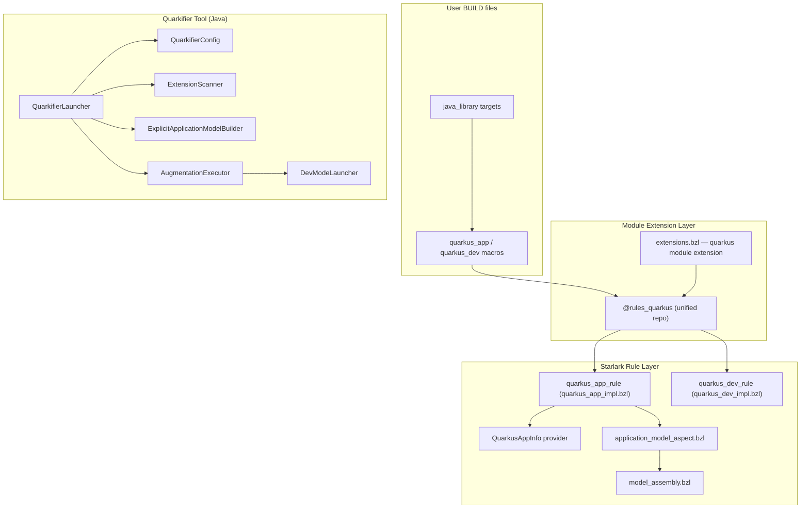
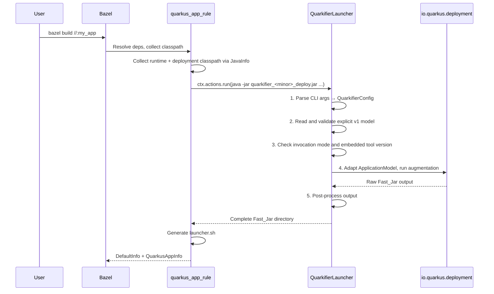

# Architecture Overview

`rules_quarkus` provides Bazel-native rules for building and running Quarkus JVM applications. Instead of wrapping Maven/Gradle plugins, it invokes the Quarkus internal build API (`io.quarkus.deployment`) directly through a custom Java tool called the **Quarkifier**. This gives Bazel full control over caching, sandboxing, and dependency tracking.

- **Module**: `com_clementguillot_rules_quarkus`
- **Quarkus versions**: 3.27.4 LTS, 3.33.2 LTS
- **Version scope**: one configured Quarkus version per Bazel workspace (either `3.27.4` or `3.33.2`)
- **Java**: 17+
- **Bazel**: 7+, 8+, or 9+ (bzlmod only, WORKSPACE not supported)

## Key Design Decisions

| Decision | Rationale |
|---|---|
| Direct Quarkus build API instead of Maven/Gradle wrapper | Avoids shelling out to external build tools; enables proper Bazel action caching and sandboxing |
| Quarkifier as a separate Java binary | Isolates Quarkus deployment classpath from the user's build classpath; can be versioned independently |
| Fast_Jar as default packaging | Quarkus's recommended format; fastest startup; simplest directory layout to produce |
| Explicit ApplicationModel | A Bazel aspect and resolver catalogs preserve graph/workspace facts before a version-specific Java adapter applies Quarkus semantics |
| Deployment artifact auto-resolution via descriptors + Coursier | Module extension scans locked jars for exact `deployment-artifact` coordinates and resolves their transitive graph |
| One generated repository from module extension | Keeps generated rules, the versioned Quarkifier, model catalogs, and copied deployment artifacts under `@rules_quarkus` |
| Post-processing of Fast_Jar output | Quarkus augmentation output uses raw classpath filenames; post-processing normalizes jar names, classifies boot vs main, and regenerates metadata |

## Three-Layer Architecture



## Module Extension System

The `quarkus` module extension (`quarkus/extensions.bzl`) creates a single unified repository:

Current limitation: the extension consumes the first `quarkus.toolchain()` tag and creates a fixed repository name (`@rules_quarkus`). This means version selection is workspace-wide. You can choose `3.27.4` or `3.33.2` per workspace, but one workspace cannot currently build different Quarkus versions side by side.

### @rules_quarkus

A single generated repository containing everything needed to build Quarkus applications:

- **`quarkus/defs.bzl`** — public API macros (`quarkus_app`, `quarkus_test`) with toolchain-specific defaults injected (quarkus version, quarkifier tool path, deployment deps)
- **`quarkifier/tool.jar`** — the quarkifier deploy jar, resolved in priority order:
  1. **Local source build** — user provides `quarkifier_source_dir`, the extension builds and symlinks the deploy jar
  2. **GitHub release download** — fetches from `https://github.com/clementguillot/rules_quarkus/releases/`
- **`model/`** — strict runtime, deployment, and platform catalogs used by the hermetic model-assembly action
- **`deployment/`** — deployment jars downloaded with transitive dependencies using Coursier. Extension runtime jars pinned by `maven_install.json` are scanned for `META-INF/quarkus-extension.properties`; the exact descriptor-declared deployment coordinate is resolved without artifact-name guessing. Produces two `java_library` targets:
  - `:core` — transitive deps of `quarkus-core-deployment` (used for the dev jar manifest classpath)
  - `:all` — all deployment jars including extension-specific deployment jars and conditional dev dependencies

Deployment jars are copied into the generated repository in Maven directory
layout. Copying makes them stable Bazel inputs even if the machine-global
Coursier cache changes, while retaining the layout needed by Dev UI version
extraction.

## Explicit ApplicationModel flow

Every lifecycle rule applies the same internal aspect to its ordinary
`java_library` graph. The aspect emits small, version-independent target
fragments containing direct edges, artifact outputs, source/resources, build
files, workspace identity, and local-extension aliases. A hermetic action joins
those fragments with the generated resolver catalogs and validates
`quarkus-bazel-model-v1`.

The Quarkifier reads that contract and uses the adapter compiled for the chosen
Quarkus line to construct `ApplicationModel`. It does not infer graph edges from
jar names or embedded POMs on this path. Normal, dev, test, and native-sources
all use this boundary; only lifecycle-specific root/test facts differ.

See [ADR 0001](adr/0001-explicit-application-model.md) for the ownership and DX
invariants.

## Build Flow



## Quarkifier Pipeline

See [Quarkifier Tool Reference](quarkifier.md) for the full pipeline details.

The pipeline in brief:

1. **CLI parsing** → `QuarkifierConfig` record
2. **Explicit model validation** → checks schema, graph invariants, mode, and tool version
3. **Deployment resolution** → matches extensions to `-deployment` jars
4. **Version checking** → warns on mismatches against expected Quarkus version
5. **Augmentation** → builds `ApplicationModel`, runs `QuarkusBootstrap` → `AugmentAction`
6. **Post-processing** → `assembleLibDirectories`, `assembleResourcesJar`, `regenerateApplicationDat`, `fixRunnerManifest`

For DEV mode, step 5 delegates to `DevModeLauncher` instead. See [Dev Mode](dev-mode.md).

## Fast_Jar Output Structure

```
output-dir/
└── quarkus-app/
    ├── quarkus-run.jar                 # Thin launcher jar (manifest with Class-Path)
    ├── quarkus/
    │   ├── quarkus-application.dat     # Serialized application metadata (regenerated)
    │   ├── generated-bytecode.jar      # Augmentation-generated classes
    │   └── transformed-bytecode.jar    # Transformed application classes
    ├── app/
    │   ├── *.jar                       # Application class jars
    │   └── resources.jar               # User resources (application.properties, etc.)
    └── lib/
        ├── main/
        │   └── *.jar                   # Runtime dependency jars (groupId.artifactId-version.jar)
        └── boot/
            └── *.jar                   # Bootstrap jars (parent-first for LogManager)
```

Jars in `lib/boot/` are loaded by the parent classloader (before the main app classloader). This is critical for JBoss LogManager to intercept JUL before any other logging framework initializes. The `quarkus-run.jar` manifest `Class-Path` points to these boot jars.

## QuarkusAppInfo Provider

Custom Starlark provider that carries augmentation metadata between rules:

```starlark
QuarkusAppInfo = provider(
    fields = {
        "fast_jar_dir":            "Directory containing the Fast_Jar output",
        "application_classpath":   "Depset of runtime classpath jars",
        "source_dirs":             "Depset of source directories (for dev mode)",
        "quarkus_version":         "String: Quarkus version used",
    },
)
```

## Project Structure

```
rules_quarkus/
├── MODULE.bazel                    # Module: com_clementguillot_rules_quarkus
├── quarkus/
│   ├── defs.bzl                    # Re-exports for toolchains repo
│   ├── extensions.bzl              # Bzlmod module extension (creates 3 repos)
│   ├── providers.bzl               # QuarkusAppInfo provider
│   └── private/
│       ├── quarkus_app_impl.bzl    # quarkus_app rule implementation
│       ├── quarkus_dev_impl.bzl    # quarkus_dev rule implementation
│       ├── quarkus_test_impl.bzl   # quarkus_test rule implementation
│       ├── classpath_utils.bzl     # collect_runtime_classpath, collect_source_dirs
│       ├── launcher.sh.tpl         # Production launcher script template
│       ├── dev_launcher.sh.tpl     # Dev mode launcher script template
│       └── versions.bzl            # SUPPORTED_VERSIONS, RULES_VERSION, etc.
├── quarkifier/
│   ├── BUILD.bazel                 # java_library, java_binary, java_test targets
│   └── src/
│       ├── main/java/...           # Quarkifier tool source (shared across versions)
│       ├── main/java_3_27/...      # Version-specific source for Quarkus 3.27
│       ├── main/java_3_33/...      # Version-specific source for Quarkus 3.33
│       └── test/java/...           # Unit + property-based tests
├── examples/
│   ├── helloworld_3_27/            # Example project using Quarkus 3.27
│   └── helloworld_3_33/            # Example project using Quarkus 3.33
└── e2e/smoke/                      # E2E smoke tests (bzlmod, Bazel 7/8/9)
```
