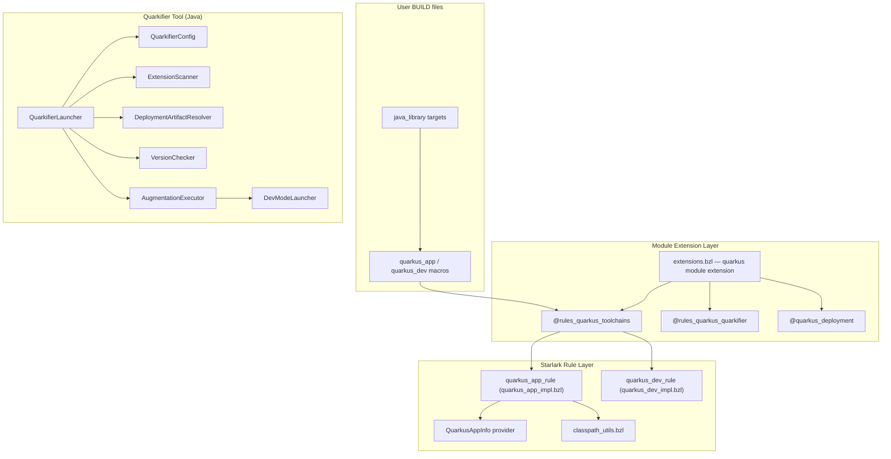
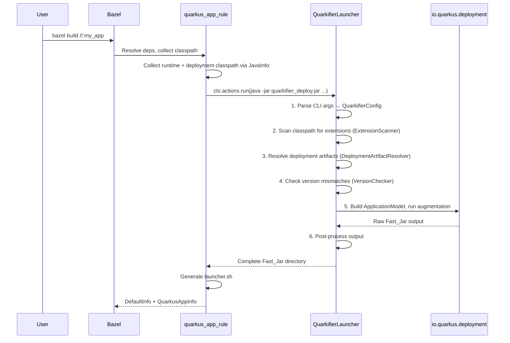

# Architecture Overview

`rules_quarkus` provides Bazel-native rules for building and running Quarkus JVM applications. Instead of wrapping Maven/Gradle plugins, it invokes the Quarkus internal build API (`io.quarkus.deployment`) directly through a custom Java tool called the **Quarkifier**. This gives Bazel full control over caching, sandboxing, and dependency tracking.

- **Module**: `com_clementguillot_rules_quarkus`
- **Quarkus version**: 3.27.3 LTS
- **Java**: 17+
- **Bazel**: 7+

## Key Design Decisions

| Decision | Rationale |
|---|---|
| Direct Quarkus build API instead of Maven/Gradle wrapper | Avoids shelling out to external build tools; enables proper Bazel action caching and sandboxing |
| Quarkifier as a separate Java binary | Isolates Quarkus deployment classpath from the user's build classpath; can be versioned independently |
| Fast_Jar as default packaging | Quarkus's recommended format; fastest startup; simplest directory layout to produce |
| Deployment artifact auto-resolution via lock file + Coursier | Module extension reads `maven_install.json` to discover extensions, downloads `-deployment` counterparts with transitive deps |
| Three generated repositories from module extension | Separates concerns: toolchains config, quarkifier tool, deployment deps |
| Post-processing of Fast_Jar output | Quarkus augmentation output uses raw classpath filenames; post-processing normalizes jar names, classifies boot vs main, and regenerates metadata |

## Three-Layer Architecture



## Module Extension System

The `quarkus` module extension (`quarkus/extensions.bzl`) creates **three repositories**:

### @rules_quarkus_toolchains

Generated repo containing `defs.bzl` with `quarkus_app` and `quarkus_dev` macros. These macros wrap the internal rule implementations with toolchain-specific defaults (quarkus version, quarkifier tool path, deployment deps target).

### @rules_quarkus_quarkifier

Contains the quarkifier JAR. Resolved in priority order:
1. **Direct override** — user provides a `quarkifier_tool` label
2. **Local source build** — user provides `quarkifier_source_dir`, the extension symlinks deploy jars from `bazel-bin/`
3. **GitHub release download** — fetches from `https://github.com/clementguillot/rules_quarkus/releases/`

### @quarkus_deployment

Downloads all deployment jars with transitive dependencies using Coursier. Auto-discovers Quarkus extensions from the user's `maven_install.json` by scanning for artifacts matching configurable group prefixes (default: `io.quarkus`, `io.quarkiverse.`), then appends `-deployment` to each artifact ID.

## Build Flow



## Quarkifier Pipeline

See [Quarkifier Tool Reference](quarkifier.md) for the full pipeline details.

The pipeline in brief:

1. **CLI parsing** → `QuarkifierConfig` record
2. **Extension scanning** → reads `META-INF/quarkus-extension.properties` from each jar
3. **Deployment resolution** → matches extensions to `-deployment` jars
4. **Version checking** → warns on mismatches against expected Quarkus version
5. **Augmentation** → builds `ApplicationModel`, runs `QuarkusBootstrap` → `AugmentAction`
6. **Post-processing** → `assembleLibDirectories`, `assembleResourcesJar`, `regenerateApplicationDat`, `fixRunnerManifest`

For DEV mode, step 5 delegates to `DevModeLauncher` instead. See [Dev Mode](dev-mode.md).

## Fast_Jar Output Structure

```
output-dir/
└── quarkus-app/
    ├── quarkus-run.jar                 # Thin launcher jar (manifest with Class-Path)
    ├── quarkus/
    │   ├── quarkus-application.dat     # Serialized application metadata (regenerated)
    │   ├── generated-bytecode.jar      # Augmentation-generated classes
    │   └── transformed-bytecode.jar    # Transformed application classes
    ├── app/
    │   ├── *.jar                       # Application class jars
    │   └── resources.jar               # User resources (application.properties, etc.)
    └── lib/
        ├── main/
        │   └── *.jar                   # Runtime dependency jars (groupId.artifactId-version.jar)
        └── boot/
            └── *.jar                   # Bootstrap jars (parent-first for LogManager)
```

Jars in `lib/boot/` are loaded by the parent classloader (before the main app classloader). This is critical for JBoss LogManager to intercept JUL before any other logging framework initializes. The `quarkus-run.jar` manifest `Class-Path` points to these boot jars.

## QuarkusAppInfo Provider

Custom Starlark provider that carries augmentation metadata between rules:

```python
QuarkusAppInfo = provider(
    fields = {
        "fast_jar_dir":            "Directory containing the Fast_Jar output",
        "application_classpath":   "Depset of runtime classpath jars",
        "source_dirs":             "Depset of source directories (for dev mode)",
        "quarkus_version":         "String: Quarkus version used",
    },
)
```

## Project Structure

```
rules_quarkus/
├── MODULE.bazel                    # Module: com_clementguillot_rules_quarkus
├── quarkus/
│   ├── defs.bzl                    # Re-exports for toolchains repo
│   ├── extensions.bzl              # Bzlmod module extension (creates 3 repos)
│   ├── providers.bzl               # QuarkusAppInfo provider
│   └── private/
│       ├── quarkus_app_impl.bzl    # quarkus_app rule implementation
│       ├── quarkus_dev_impl.bzl    # quarkus_dev rule implementation
│       ├── classpath_utils.bzl     # collect_runtime_classpath, collect_source_dirs
│       ├── launcher.sh.tpl         # Production launcher script template
│       ├── dev_launcher.sh.tpl     # Dev mode launcher script template
│       └── versions.bzl            # SUPPORTED_VERSIONS, RULES_VERSION, etc.
├── quarkifier/
│   ├── BUILD.bazel                 # java_library, java_binary, java_test targets
│   └── src/
│       ├── main/java/...           # Quarkifier tool source
│       └── test/java/...           # Unit + property-based tests
├── examples/
│   └── helloworld/                 # Full example project
└── e2e/smoke/                      # Smoke test as external workspace
```
