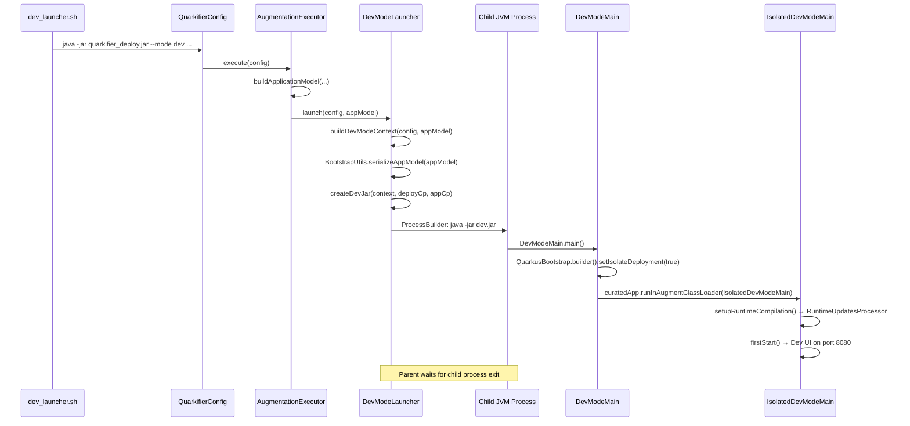
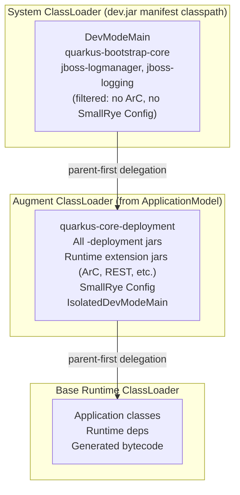

# Dev Mode & Dev UI Integration

This document captures the hard-won knowledge from implementing Quarkus dev mode in Bazel. Dev mode is the most complex part of `rules_quarkus` due to classloader isolation requirements.

## Overview

Dev mode launches Quarkus with the Dev UI, hot-reload, and Dev Services support. The core challenge is **classloader isolation**: the quarkifier deploy jar's classpath and the `ApplicationModel`'s deployment dependencies overlap, causing `LinkageError` and `VerifyError` if not handled carefully.

The solution follows Maven's `DevMojo` pattern: a **separate JVM process** is started with a minimal "dev jar" that contains only bootstrap classes. All deployment and runtime extension jars are loaded exclusively by the augment classloader from a serialized `ApplicationModel`.

## The Subprocess Approach

Unlike production augmentation (which runs in-process), dev mode uses a **separate JVM process**:

1. `AugmentationExecutor.execute()` detects `mode == DEV` and delegates to `DevModeLauncher.launch()`
2. `DevModeLauncher` serializes the `ApplicationModel` to a temp file
3. `DevModeLauncher` creates a minimal "dev jar" with a serialized `DevModeContext` and a filtered manifest classpath
4. A child `java -jar dev.jar` process is started with `ProcessBuilder`
5. The child process runs `DevModeMain.main()` → `IsolatedDevModeMain` inside a clean augment classloader
6. The parent process waits for the child to exit, with a shutdown hook to destroy it on SIGTERM

This mirrors how Maven's `DevMojo` works and avoids classloader conflicts between the quarkifier's system classloader and the Quarkus deployment classloader.

## Launch Sequence



## The Dev Jar

`DevModeLauncher.createDevJar()` creates a temporary JAR containing:

1. **`META-INF/MANIFEST.MF`** — with `Main-Class: io.quarkus.deployment.dev.DevModeMain` and a `Class-Path` pointing to deployment jars (as `file:///` URIs)
2. **Serialized `DevModeContext`** — at the entry path `DevModeMain.DEV_MODE_CONTEXT`, containing module info, source paths, and build system properties

### Manifest Classpath Filtering

The manifest classpath includes all deployment jars **except**:

- **Runtime extension jars** — jars containing `META-INF/quarkus-extension.properties` (e.g., `quarkus-arc`, `quarkus-rest`). These contain CDI beans whose ArC-generated proxies cause `VerifyError` when the bean class is loaded by the system classloader and the proxy by the augment classloader.
- **SmallRye Config jars** — `smallrye-config`, `smallrye-config-core`, `smallrye-config-common`, `smallrye-config-inject`, `microprofile-config-api`. These cause `ClassCastException` across classloader boundaries.

These excluded jars are loaded exclusively by the augment classloader from the `ApplicationModel`.

## Classloader Isolation Strategy



The key insight: the system classloader must contain **only** bootstrap infrastructure. Everything else comes from the augment classloader via the `ApplicationModel`.

### Why Runtime Extension Jars Must Be Excluded

Runtime extension jars like `quarkus-arc` contain CDI beans. During augmentation, ArC generates proxy classes that extend these beans. If the bean class is loaded by the system classloader and the proxy by the augment classloader, the JVM throws `VerifyError` because the proxy tries to access protected methods across classloader boundaries.

### Why SmallRye Config Must Be Excluded

SmallRye Config classes are used by both the bootstrap code and the augment classloader. If loaded on both, `ClassCastException` occurs when config objects cross the classloader boundary.

## Single Quarkifier JAR for Both Modes

Both `quarkus_app` (production) and `quarkus_dev` (dev mode) use the same `quarkifier_deploy.jar`. A separate "dev bootstrap" JAR is not needed because:

1. Dev mode spawns a **separate child JVM process** — the parent quarkifier process and child dev process have independent classloaders
2. `DevModeLauncher.createDevJar()` performs **runtime filtering** of the manifest classpath, excluding runtime extension JARs (ArC, REST, etc.) and SmallRye Config JARs
3. The child JVM's system classloader only sees what's in the dev.jar manifest `Class-Path`, which never includes ArC

The parent quarkifier process having ArC on its classpath is irrelevant — the JVM process boundary is the classloader isolation mechanism. This is the same approach Maven's `DevMojo` uses: the Maven process itself has all dependencies, but the forked dev mode process gets a filtered classpath.

## The GACT Key Mismatch Bug

**Problem**: `handleExtensionProperties()` processes `runner-parent-first-artifacts` from `quarkus-extension.properties` and creates GACT (Group-Artifact-Classifier-Type) keys with **empty type**. But our manually-added dependencies have type `"jar"`. The keys don't match, so `buildDependencies()` never sets the `CLASSLOADER_RUNNER_PARENT_FIRST` flag.

**Workaround**: In `AugmentationExecutor.buildApplicationModel()`, we manually set the `CLASSLOADER_RUNNER_PARENT_FIRST` flag by matching on `artifactId`:

```java
Set<String> runnerParentFirstArtifactIds = Set.of(
    "quarkus-bootstrap-runner", "quarkus-classloader-commons",
    "quarkus-development-mode-spi",
    "jboss-logmanager", "jboss-logging",
    "slf4j-jboss-logmanager", "slf4j-api",
    "smallrye-common-constraint", "smallrye-common-cpu",
    // ... more artifacts
);
for (var dep : modelBuilder.getDependencies()) {
    if (runnerParentFirstArtifactIds.contains(dep.getArtifactId())) {
        dep.setFlags(DependencyFlags.CLASSLOADER_RUNNER_PARENT_FIRST);
    }
}
```

This is a known Quarkus bootstrap bug that affects anyone building an `ApplicationModel` manually (outside Maven/Gradle).

## Extension Capabilities Registration

**Problem**: `handleExtensionProperties()` does NOT process `provides-capabilities` and `requires-capabilities` from `quarkus-extension.properties`. In Maven/Gradle, the resolver handles this automatically. Since we bypass the resolver, capabilities like `VERTX_HTTP` are missing, causing build steps to fail.

**Workaround**: In `registerExtensions()`, we manually read and register capabilities:

```java
String providesCapabilities = props.getProperty("provides-capabilities");
String requiresCapabilities = props.getProperty("requires-capabilities");
if (providesCapabilities != null || requiresCapabilities != null) {
    modelBuilder.addExtensionCapabilities(
        CapabilityContract.of(compactCoords, providesCapabilities, requiresCapabilities));
}
```

## Parent-First Artifact Lists

The `buildApplicationModel()` method maintains two separate parent-first lists:

### 1. Augment Classloader Parent-First (`parentFirstArtifactIds`)

These jars are delegated to the parent (system) classloader by the augment classloader. This prevents `LinkageError` and `ClassCastException`:

- **Bootstrap infrastructure**: `quarkus-bootstrap-core`, `quarkus-bootstrap-app-model`, `quarkus-bootstrap-runner`, `quarkus-classloader-commons`
- **Core**: `quarkus-core` (needed by `IsolatedDevModeMain`)
- **Config**: `smallrye-config`, `smallrye-config-core`, `smallrye-config-common`, `microprofile-config-api`
- **Logging**: `jboss-logmanager`, `jboss-logging`, `slf4j-api`, `slf4j-jboss-logmanager`
- **Jakarta APIs**: `jakarta.enterprise.cdi-api`, `jakarta.inject-api`, `jakarta.interceptor-api`, etc.
- **Maven resolver**: `maven-resolver-api`, `maven-model`, etc. (prevents `ClassCastException` on `RemoteRepository` in the Extensions Dev UI panel)

### 2. Runner Parent-First (`runnerParentFirstArtifactIds`)

These jars get the `CLASSLOADER_RUNNER_PARENT_FIRST` flag for the production `RunnerClassLoader`. This is the workaround for the GACT key mismatch bug described above.

## DevModeContext Construction

`DevModeLauncher.buildDevModeContext()` creates the context that `DevModeMain` needs:

```java
context.setAbortOnFailedStart(true);       // surface failures immediately
context.setLocalProjectDiscovery(false);    // Bazel manages all deps
context.setMode(QuarkusBootstrap.Mode.DEV);

// ModuleInfo with source paths for hot-reload
new DevModeContext.ModuleInfo.Builder()
    .setSourcePaths(PathList.from(config.sourceDirs()))
    .setClassesPath(appJar.toAbsolutePath().toString())
    .setResourcePaths(PathList.from(config.resources()))
    .build();
```

Key settings:
- `abortOnFailedStart=true` — without this, startup failures silently call `System.exit(1)`
- `localProjectDiscovery=false` — Bazel manages all dependencies, no Maven-style project scanning
- Source paths come from `--source-dirs` CLI argument, which the Starlark rule populates from `java_library` deps

## Source Directory Flow

The `quarkus_dev_impl.bzl` rule collects source directories from `java_library` deps:

1. `_collect_java_source_dirs()` examines source files from each dep's `DefaultInfo`
2. It finds standard Maven-layout markers (`src/main/java`, `src/test/java`) in file paths
3. Source dir paths are written to a file in the runfiles
4. `dev_launcher.sh.tpl` reads the file and passes `--source-dirs` to the quarkifier CLI
5. `DevModeLauncher` sets these as `sourcePaths` in `DevModeContext.ModuleInfo`
6. `IsolatedDevModeMain.setupRuntimeCompilation()` creates a `RuntimeUpdatesProcessor` that watches these directories

When source dirs are empty, hot-reload is disabled but the Dev UI still works.

## Known Limitations

### Extensions Panel (Not Yet Fixed)

The Extensions panel in the Dev UI doesn't work. It tries to use Maven resolver classes to fetch extension metadata, which fails in the Bazel environment.

### No In-Process Dev Mode

Dev mode always uses a separate JVM process. In-process dev mode is not supported because the quarkifier's system classloader would conflict with the augment classloader. This adds ~2-3 seconds of startup overhead.

### Docker Required for Dev Services

Dev Services (auto-provisioned databases, message brokers, etc.) require Docker on the host. If Docker is unavailable, Quarkus reports an error.

## Starlark Rule: quarkus_dev

The `quarkus_dev` rule (`quarkus/private/quarkus_dev_impl.bzl`) is the Bazel entry point for dev mode:

```python
load("@rules_quarkus_toolchains//:defs.bzl", "quarkus_dev")

quarkus_dev(
    name = "dev",
    deps = [":lib"],
)
```

It uses the same `quarkifier_deploy.jar` as production and generates a `dev_launcher.sh` script that:
1. Reads application and deployment classpaths from files
2. Reads source directories from a file
3. Creates a temp output directory
4. Runs `java -jar quarkifier_deploy.jar --mode dev --source-dirs ...`

## Troubleshooting

### LinkageError or VerifyError on startup

The dev.jar manifest classpath may overlap with the `ApplicationModel`. Check that `DevModeLauncher.createDevJar()` is correctly excluding runtime extension JARs (those with `META-INF/quarkus-extension.properties`) and SmallRye Config JARs from the manifest `Class-Path`.

### "Key already registered" from ConsoleStateManager

Static state from a previous run persists. The `clearConsoleState()` helper in `AugmentationExecutor` handles this, but if you see it, the console state wasn't cleared before launch.

### Silent exit with no error

`abortOnFailedStart` may not be set to `true`. Check `DevModeLauncher.buildDevModeContext()`.

### Hot-reload not working

Source directories may not be reaching the `DevModeContext`. Check:
1. `_collect_java_source_dirs()` finds your source roots
2. The source dirs file is non-empty in runfiles
3. `--source-dirs` appears in the quarkifier CLI invocation
