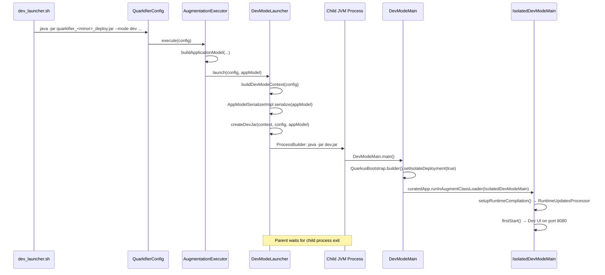
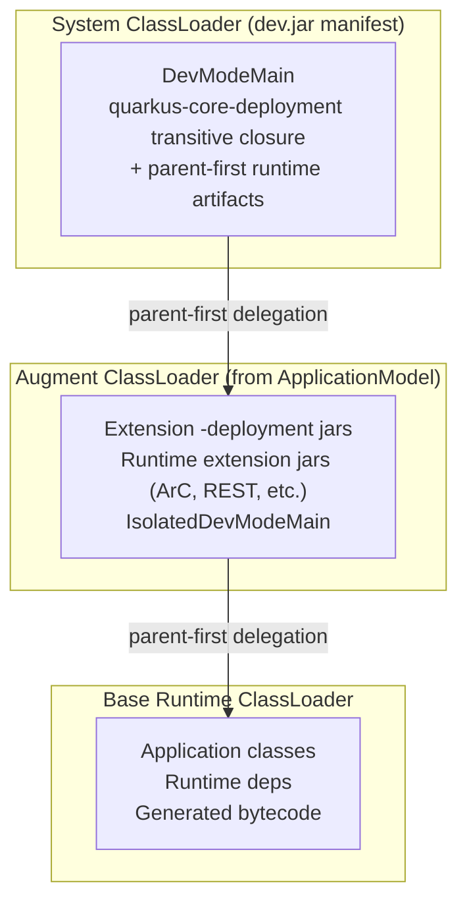

# Dev Mode & Dev UI Integration

Dev mode is the most complex part of `rules_quarkus` due to classloader isolation requirements. This document captures the key design decisions and troubleshooting knowledge.

## Overview

Dev mode launches Quarkus with the Dev UI, hot-reload, and Dev Services support. The core challenge is **classloader isolation**: the quarkifier deploy jar's classpath and the `ApplicationModel`'s deployment dependencies overlap, causing `LinkageError` and `VerifyError` if not handled carefully.

The solution follows Maven's `DevMojo` pattern: a **separate JVM process** is started with a minimal "dev jar" that contains only bootstrap classes. All deployment and runtime extension jars are loaded exclusively by the augment classloader from a serialized `ApplicationModel`.

## The Subprocess Approach

Unlike production augmentation (which runs in-process), dev mode uses a **separate JVM process**:

1. `AugmentationExecutor.execute()` detects `mode == DEV` and delegates to `DevModeLauncher.launch()`
2. `DevModeLauncher` serializes the `ApplicationModel` to a temp file
3. `DevModeLauncher` creates a minimal "dev jar" with a serialized `DevModeContext` and a precisely scoped manifest classpath
4. A child `java -jar dev.jar` process is started with `ProcessBuilder`
5. The child process runs `DevModeMain.main()` → `IsolatedDevModeMain` inside a clean augment classloader
6. The parent process waits for the child to exit, with a shutdown hook to destroy it on SIGTERM

## Launch Sequence

## The Dev Jar

`DevModeLauncher.createDevJar()` creates a temporary JAR containing:

1. **`META-INF/MANIFEST.MF`** — with `Main-Class: io.quarkus.deployment.dev.DevModeMain` and a `Class-Path` pointing to deployment infrastructure jars (as `file:///` URIs)
2. **Serialized `DevModeContext`** — at the entry path `DevModeMain.DEV_MODE_CONTEXT`, containing module info, source paths, and build system properties

### Manifest Classpath Strategy

The manifest classpath contains two categories of jars, matching Maven's `DevMojo`:

1. **Core deployment infrastructure** — the transitive closure of `quarkus-core-deployment`, resolved separately via `@quarkus_deployment//:core`. For jars that also exist on the application classpath, the `@maven` version is preferred to avoid class identity conflicts between Coursier and `rules_jvm_external` copies.

2. **Parent-first runtime artifacts** — runtime jars flagged as `CLASSLOADER_PARENT_FIRST` in the `ApplicationModel` (logging, Jakarta APIs, etc.).

Everything else — extension deployment jars, runtime extension jars — is loaded by the augment classloader from the serialized `ApplicationModel`.

## Three Classpaths

The `quarkus_dev` rule manages three separate classpaths:

| Classpath | Source | Purpose |
|-----------|--------|---------|
| `application_classpath` | `deps` runtime jars | Runtime deps for the ApplicationModel |
| `deployment_classpath` | `@quarkus_deployment//:all` | All deployment jars for the ApplicationModel |
| `core_deployment_classpath` | `@quarkus_deployment//:core` | Core deployment infrastructure for the dev jar manifest |

The `@quarkus_deployment` repo resolves these in two Coursier phases:
1. `coursier fetch io.quarkus:quarkus-core-deployment:VERSION` → `:core` target (~70 jars)
2. `coursier fetch` all extension deployment GAVs → `:all` target (superset of `:core`, ~300 jars)

## Classloader Hierarchy

## Conditional Dev Dependencies

Many Quarkus extensions declare `conditional-dev-dependencies` in their `quarkus-extension.properties`. These are runtime modules activated only in dev mode. Maven's resolver handles them automatically; we resolve them explicitly in `extensions.bzl`:

- **`quarkus-devui-deployment`** — conditional dev dep of `quarkus-vertx-http` (provides the Dev UI)
- **`quarkus-devui`** — the Dev UI runtime jar; its generated ArC beans reference classes that must be on the runtime classpath
- **`quarkus-devui-spi`** — contains SPI classes (e.g., `McpServerConfiguration`) referenced by generated ArC beans; has no extension metadata so it won't be auto-detected
- **`{extension}-dev` jars** (e.g., `quarkus-arc-dev`, `quarkus-rest-dev`) — contain dev-mode-specific classes like `EventsMonitor` that Dev UI build steps reference

The `QuarkusAppModelBuilder` also scans the deployment classpath for runtime extensions pulled in transitively (e.g., `quarkus-devui` via `quarkus-devui-deployment`) and marks them appropriately in the `ApplicationModel`. Additionally, `io.quarkus` jars ending with `-spi` are automatically marked as runtime classpath entries.

## Parent-First Artifacts

`QuarkusAppModelBuilder.markParentFirstArtifacts()` marks infrastructure jars as parent-first so the augment classloader delegates to the system classloader for them. This prevents `LinkageError` and `ClassCastException`.

Key categories: bootstrap (`quarkus-bootstrap-core`, `quarkus-bootstrap-maven-resolver`, etc.), core (`quarkus-core`, `quarkus-value-registry`), config (`smallrye-config-core`, `smallrye-config-common`, `microprofile-config-api`), logging (`jboss-logmanager`, `jboss-logging`), Jakarta APIs.

**Important**: `smallrye-config` itself is NOT parent-first. In SmallRye Config 3.13+, the main jar contains CDI beans (`ConfigProducer`) whose ArC-generated proxies cause `VerifyError` when the bean class and proxy are loaded by different classloaders.

## Known Quarkus Bootstrap Workarounds

### ApplicationModel Serialization Format

Quarkus 3.31+ changed `ApplicationModelSerializer` to use JSON format by default instead of Java Object Serialization. The `DevModeLauncher` uses a version-specific `AppModelSerializerStrategy`:
- **3.27**: `BootstrapUtils.serializeAppModel()` (Java Object Serialization)
- **3.33+**: `ApplicationModelSerializer.serialize()` (JSON)

### PlatformImports Null Check

`ApplicationModel.asMap()` (used by the JSON serializer) calls `getPlatforms().asMap()` without a null check. Since we bypass Maven/Gradle resolution, `platformImports` is never set. Workaround: `QuarkusAppModelBuilder` sets an empty `PlatformImportsImpl()`.

### GACT Key Mismatch

`handleExtensionProperties()` creates GACT keys with empty type, but our dependencies have type `"jar"`. The `CLASSLOADER_RUNNER_PARENT_FIRST` flag is never set by `buildDependencies()`. Workaround: `fixRunnerParentFirstFlags()` sets the flag by `artifactId` matching.

### Extension Capabilities

`handleExtensionProperties()` doesn't process `provides-capabilities` / `requires-capabilities`. Workaround: `registerExtensions()` manually reads and registers them.

## Source Directory Flow

1. `_collect_java_source_dirs()` in the Starlark rule finds `src/main/java` markers in dep source files
2. Source dirs are written to a runfiles file and passed via `--source-dirs`
3. `DevModeLauncher` sets them as `sourcePaths` in `DevModeContext.ModuleInfo`
4. `IsolatedDevModeMain` creates a `RuntimeUpdatesProcessor` that watches these directories

When source dirs are empty, hot-reload is disabled but the Dev UI still works.

## Known Limitations

- **Extensions panel**: The Dev UI Extensions panel doesn't work — it uses Maven resolver classes unavailable in Bazel (produces `ClassCastException` for `RemoteRepository` across classloaders).
- **No in-process dev mode**: Always uses a separate JVM process (~2-3s startup overhead).
- **Docker required for Dev Services**: Dev Services need Docker on the host.

## Dev UI Static Resources

The Dev UI serves static resources (Vaadin web components, flag-icons, etc.) from jars in the deployment classpath. These jars contain resources under `META-INF/resources/_static/`. The `BuildTimeContentProcessor.extractJsVersionsFor()` method parses the version from the jar URL path by finding the artifact name and taking the next path segment.

For this to work correctly, the `@quarkus_deployment` repo preserves the Maven directory structure in its symlinks (e.g., `jars/org/mvnpm/flag-icons/7.5.0/flag-icons-7.5.0.jar`). A flat `jars/filename.jar` layout would cause the version extraction to include `.jar` in the version string, producing broken URLs like `/q/_static/flag-icons/7.5.0.jar/...`.

## Troubleshooting

### LinkageError or VerifyError on startup

Check for duplicate jars across classloaders. Common causes:
- A jar exists in both `@maven` (processed) and Coursier cache (original) with different file identities
- A jar containing CDI beans is marked as parent-first (loaded by system CL, proxy generated in runtime CL)
- An extension-specific deployment jar leaked into the core deployment classpath

### Silent exit with no error

`abortOnFailedStart` may not be set to `true`. Check `DevModeLauncher.buildDevModeContext()`.

### Hot-reload not working

Check that `_collect_java_source_dirs()` finds your source roots, the source dirs file is non-empty in runfiles, and `--source-dirs` appears in the quarkifier CLI invocation.
