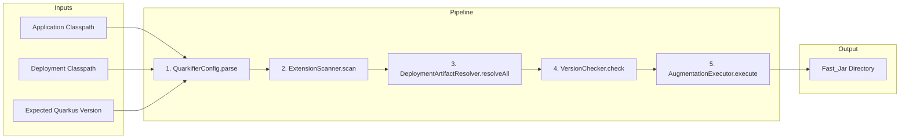

# Quarkifier Tool Reference

The Quarkifier (`com.clementguillot.quarkifier`) is a standalone Java tool that invokes the Quarkus internal build API (`io.quarkus.deployment`) to perform build-time augmentation. It is the core engine behind `rules_quarkus`.

- **Main class**: `com.clementguillot.quarkifier.QuarkifierLauncher`
- **Built against**: Quarkus 3.20.6 LTS

## CLI Interface

```
java -jar quarkifier_deploy.jar \
  --application-classpath <jar:jar:...> \
  --deployment-classpath <jar:jar:...> \
  --output-dir <path> \
  [--application-properties <path>] \
  [--resources <path,path,...>] \
  [--mode normal|test|dev] \
  [--expected-quarkus-version <version>] \
  [--app-name <name>] \
  [--app-version <version>] \
  [--source-dirs <dir,dir,...>]
```

### Flags

| Flag | Required | Default | Description |
|---|---|---|---|
| `--application-classpath` | Yes | — | Colon-separated list of runtime jars |
| `--deployment-classpath` | Yes | — | Colon-separated list of runtime + deployment jars |
| `--output-dir` | Yes | — | Directory where Fast_Jar output is written |
| `--application-properties` | No | `null` | Path to `application.properties` |
| `--resources` | No | `[]` | Comma-separated list of resource file paths |
| `--mode` | No | `normal` | Augmentation mode: `normal`, `test`, or `dev` |
| `--expected-quarkus-version` | No | `null` | Expected Quarkus version for mismatch warnings |
| `--app-name` | No | `null` | Application name for Quarkus startup banner |
| `--app-version` | No | `null` | Application version for Quarkus startup banner |
| `--source-dirs` | No | `[]` | Comma-separated source directories for dev mode hot-reload |

### Exit Codes

| Code | Meaning |
|---|---|
| 0 | Success (warnings may have been emitted to stderr) |
| 1 | Augmentation failure (stack trace on stderr) |
| 2 | Invalid CLI arguments (usage message on stderr) |

## QuarkifierConfig Record

All CLI arguments are parsed into an immutable `QuarkifierConfig` record:

```java
public record QuarkifierConfig(
    List<Path> applicationClasspath,
    List<Path> deploymentClasspath,
    Path outputDir,
    Path applicationProperties,
    List<Path> resources,
    AugmentationMode mode,
    String expectedQuarkusVersion,
    String appName,
    String appVersion,
    List<Path> sourceDirs
) { ... }
```

The record supports round-trip serialization via `toArgs()` → `parse()`, which is verified by property-based tests (200 iterations).

## Augmentation Pipeline



### Step 1: CLI Parsing

`QuarkifierConfig.parse()` validates required arguments and returns an immutable config. Exits with code 2 on invalid input.

### Step 2: Extension Scanning

`ExtensionScanner.scan()` reads `META-INF/quarkus-extension.properties` from each jar on the application classpath. For each extension found, it extracts:

| Field | Source | Example |
|---|---|---|
| `groupId` | `deployment-artifact` GAV property | `io.quarkus` |
| `artifactId` | Derived by stripping `-deployment` suffix | `quarkus-resteasy-reactive` |
| `version` | `deployment-artifact` GAV property | `3.20.6` |
| `sourceJar` | The jar that contained the metadata | `/path/to/quarkus-rest-3.20.6.jar` |

### Step 3: Deployment Artifact Resolution

`DeploymentArtifactResolver.resolveAll()` matches each extension to its `-deployment` jar on the deployment classpath. The naming convention is `artifactId + "-deployment"`. Missing deployment artifacts produce warnings (not failures).

### Step 4: Version Checking

`VersionChecker.check()` compares each extension's version against `expectedQuarkusVersion`. Mismatches produce warnings to stderr. The build continues regardless.

### Step 5: Augmentation

`AugmentationExecutor.execute()` is the core. Its behavior depends on the mode:

- **NORMAL/TEST**: Builds `ApplicationModel`, runs `QuarkusBootstrap` augmentation in-process, then post-processes the output
- **DEV**: Delegates to `DevModeLauncher` (see [Dev Mode](dev-mode.md))

## ApplicationModel Construction

`AugmentationExecutor.buildApplicationModel()` builds the model that Quarkus needs, bypassing Maven/Gradle resolution entirely:

1. **Register extensions** — scans runtime jars for `quarkus-extension.properties`, calls `modelBuilder.handleExtensionProperties()`, and manually registers capabilities (`provides-capabilities`, `requires-capabilities`)
2. **Set app artifact** — uses `MavenCoordinateParser` to extract coordinates from the app jar path
3. **Add runtime dependencies** — adds all runtime jars, marking extension jars with `setRuntimeExtensionArtifact()`
4. **Add deployment dependencies** — adds deployment-only jars, deduplicating by both `ArtifactKey` and `artifactId`
5. **Set parent-first artifacts** — marks bootstrap/infrastructure jars as parent-first for the augment classloader
6. **Fix runner-parent-first flags** — workaround for the GACT key mismatch bug (see [Dev Mode](dev-mode.md#the-gact-key-mismatch-bug))

## Post-Processing Steps

After Quarkus augmentation produces raw output, four post-processing steps normalize it into a complete Fast_Jar:

### assembleLibDirectories

Classifies runtime jars into `lib/boot/` (parent-first for LogManager) vs `lib/main/`:
- Clears jars placed by Quarkus augmentation (which use raw classpath filenames with `processed_` prefixes)
- Copies jars with clean Maven-convention names (`groupId.artifactId-version.jar`)
- Deduplicates by `artifactId:version`
- Excludes `quarkus-ide-launcher` (IDE/dev-mode helper that shades Maven/Gradle resolver classes)

### assembleResourcesJar

Creates `app/resources.jar` from user resource files (e.g., `application.properties`). Each resource is added with just its filename as the entry name.

### regenerateApplicationDat

Regenerates `quarkus/quarkus-application.dat` with correct relative paths. Jars in `lib/boot/` are registered as parent-first. This serialized metadata is read by the `RunnerClassLoader` at startup.

### fixRunnerManifest

Rewrites the `quarkus-run.jar` manifest to include boot jars in the `Class-Path` attribute. This allows `java -jar quarkus-run.jar` to find the bootstrap jars.

## MavenCoordinateParser

Extracts `groupId`/`artifactId`/`version` from jar file paths. Handles multiple path formats:

| Format | Example |
|---|---|
| Standard Maven repo | `.../io/quarkus/quarkus-arc/3.20.6/quarkus-arc-3.20.6.jar` |
| Bazel `processed_` prefix | `.../processed_quarkus-arc-3.20.6.jar` |
| Coursier cache (short) | `jars/quarkus-arc-3.20.6.jar` |

Uses stop segments (`external`, `v1`, `https`, `maven`, etc.) to identify where groupId segments begin when walking backwards from the filename.

## Key Classes

| Class | Role |
|---|---|
| `QuarkifierLauncher` | Entry point, orchestrates the pipeline |
| `QuarkifierConfig` | Immutable record for CLI config; `parse()` and `toArgs()` for round-trip |
| `AugmentationExecutor` | Builds `ApplicationModel`, runs augmentation, post-processes output |
| `AugmentationMode` | Enum: `NORMAL`, `TEST`, or `DEV` |
| `AugmentationException` | Checked exception wrapping Quarkus build errors |
| `DevModeLauncher` | Builds `DevModeContext`, launches dev mode subprocess |
| `ExtensionScanner` | Scans jars for `META-INF/quarkus-extension.properties` |
| `ExtensionInfo` | Record: `groupId`, `artifactId`, `version`, `sourceJar` |
| `DeploymentArtifactResolver` | Maps extensions to their `-deployment` jars |
| `MissingDeploymentArtifactException` | Exception with both missing and originating artifact IDs |
| `MavenCoordinateParser` | Extracts GAV coordinates from jar file paths |
| `VersionChecker` | Compares extension versions against expected version |

## Error Handling

| Condition | Behavior | Exit Code |
|---|---|---|
| Missing deployment artifact | Warning to stderr (build continues) | 0 |
| Quarkus build API exception | `AugmentationException` with stack trace | 1 |
| Invalid CLI arguments | Usage message + error to stderr | 2 |
| Empty application classpath | `AugmentationException` | 1 |
| Augmentation produces no result | `AugmentationException` | 1 |
| Version mismatch | Warning to stderr (build continues) | 0 |
