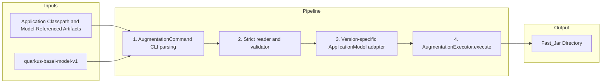

# Quarkifier Tool Reference

The Quarkifier (`com.clementguillot.quarkifier`) is a standalone Java tool that invokes the Quarkus internal build API (`io.quarkus.deployment`) to perform build-time augmentation. It is the core engine behind `rules_quarkus`.

- **Main class**: `com.clementguillot.quarkifier.QuarkifierLauncher`
- **Built against**: Quarkus 3.27.4 LTS and 3.33.2

## CLI Interface

The top-level command dispatches to `augmentation`, `assemble-model`,
`discover-extensions`, and `enrich-extension`:

```
java -jar quarkifier_<minor>_deploy.jar [--help] [--version] <command>
```

### Augmentation

```
java -jar quarkifier_<minor>_deploy.jar \
  augmentation \
  --application-classpath <jar:jar:...> \
  [--application-classpath-file <path>] \
  [--core-deployment-classpath <jar:jar:...>] \
  [--core-deployment-classpath-file <path>] \
  --output-dir <path> \
  [--resources <path,path,...>] \
  [--mode normal|test|dev|native] \
  [--app-name <name>] \
  [--main-class <class>] \
  [--native-builder-image <image>] \
  [--source-dirs <dir,dir,...>] \
  [--classes-dir <path>] \
  [--bazel-targets <label,label,...>] \
  [--classes-output-dirs <dir,dir,...>] \
  [--workspace-dir <path>] \
  [--bazel-build-timeout-seconds <seconds>] \
  [--bazel-command <path>] \
  [--bazel-build-args <flag,flag,...>] \
  [--local-app-jars <jar:jar:...>] \
  [--local-app-jars-file <path>] \
  --application-model <quarkus-bazel-model-v1.json> \
  [-h|--help] \
  [-V|--version]
```

#### Flags

| Flag | Required | Default | Description |
|---|---|---|---|
| `--application-classpath` | Yes* | — | Colon-separated list of runtime jars |
| `--application-classpath-file` | No | — | File containing the application classpath (alternative to `--application-classpath`) |
| `--core-deployment-classpath` | No | `[]` | Colon-separated list of core deployment jars (dev mode only) |
| `--core-deployment-classpath-file` | No | — | File containing the core deployment classpath |
| `--output-dir` | Yes | — | Directory where Fast_Jar output is written |
| `--resources` | No | `[]` | Comma-separated list of resource file paths |
| `--mode` | No | `normal` | Augmentation mode: `normal`, `test`, `dev`, or `native` |
| `--app-name` | No | `null` | Application name for Quarkus startup banner |
| `--main-class` | No | `null` | Fully-qualified custom main class annotated with `@QuarkusMain` |
| `--native-builder-image` | No | `null` | Native builder image for `platform.quarkus.native.builder-image` |
| `--source-dirs` | No | `[]` | Comma-separated source directories for dev mode hot-reload |
| `--classes-dir` | No | `null` | Mutable directory for .class files in dev mode |
| `--bazel-targets` | No | `[]` | Comma-separated Bazel targets to rebuild on source changes |
| `--classes-output-dirs` | No | `[]` | Comma-separated bazel-bin output directories containing .class files |
| `--workspace-dir` | No | `null` | Bazel workspace root directory for running bazel build |
| `--bazel-build-timeout-seconds` | No | `600` | Timeout in seconds for bazel build process |
| `--bazel-command` | No | `bazel` | Bazel binary to invoke for hot-reload builds |
| `--bazel-build-args` | No | `[]` | Comma-separated extra flags for the hot-reload bazel build |
| `--local-app-jars` | No | `[]` | Colon-separated local workspace jars to use as application roots |
| `--local-app-jars-file` | No | — | File containing local app jars (alternative to `--local-app-jars`) |
| `--application-model` | Yes | — | Strict `quarkus-bazel-model-v1` input; its mode and Quarkus version must match the invocation and version-specific tool |
| `-h`, `--help` | — | — | Show help message and exit |
| `-V`, `--version` | — | — | Show version info and exit |

*Either the inline flag or the `-file` variant must be provided. The `-file` variants read the classpath from a file (one line, colon-separated paths) to avoid "Argument list too long" errors on Linux when the classpath is very long. When both inline and file are provided, the file variant takes precedence regardless of argument order.

### Extension enrichment

```
java -jar quarkifier_<minor>_deploy.jar \
  enrich-extension \
  <runtime.jar> \
  <output.yaml> \
  <quarkus-version> \
  <classpath-file> \
  <extension-name> \
  <group-id> \
  <artifact-id> \
  <extension-version>
```

This command reads `META-INF/quarkus-extension.yaml` from the runtime jar, adds
canonical artifact coordinates when the descriptor omits or incompletely
declares them, adds the Quarkus core version and extension dependencies
discovered from the compile classpath, then writes the enriched YAML. A complete
user-supplied `artifact` is preserved, matching the Quarkus Maven/Gradle plugins.

### Exit Codes

| Code | Meaning |
|---|---|
| 0 | Success (warnings may have been emitted to stderr) |
| 1 | Command execution failure |
| 2 | Invalid CLI arguments (usage message on stderr) |

## Package Structure

```
com.clementguillot.quarkifier
├── QuarkifierLauncher              Entry point (thin shell, delegates to picocli)
├── QuarkifierCommand               Top-level picocli command dispatcher
├── AugmentationCommand             Parses augmentation options and executes the pipeline
├── EnrichExtensionCommand          Parses extension-enrichment arguments
├── QuarkifierConfig                Immutable record for config + toArgs() serialization
├── QuarkifierVersionProvider       Picocli IVersionProvider: reads version from classpath resource
├── AugmentationMode                Enum: NORMAL, TEST, DEV, NATIVE
├── AugmentationException           Checked exception wrapping build errors
├── BuildProperties                 Default build system properties
│
├── extension/                      Extension discovery and validation
│   ├── ExtensionInfo               Record: groupId, artifactId, version, sourceJar
│   ├── ExtensionScanner            Scans jars for quarkus-extension.properties
│   ├── ExtensionYamlEnricher       Enriches quarkus-extension.yaml build metadata
│
├── maven/                          Maven coordinate parsing
│   └── MavenCoordinateParser       Extracts GAV from jar file paths
│
├── model/                          ApplicationModel construction
│   ├── ExplicitApplicationModelBuilder  Builds from validated v1 facts
│   └── transport/                  Strict schema, assembler, validator, writer
│
├── augmentation/                   Augmentation execution and post-processing
│   ├── AugmentationExecutor        Orchestrates bootstrap + augmentation
│   ├── FastJarAssembler            Post-processes output into runnable Fast_Jar
│   └── ApplicationDatWriter        Version-safe reflection wrapper for SerializedApplication.write()
│
├── dev/                            Dev mode
│   ├── DevModeLauncher             Builds DevModeContext, launches subprocess
│   ├── AppModelSerializerStrategy  Interface for version-specific model serialization
│   └── AppModelSerializerImpl      (in java_3_27/ or java_3_33/) Version-specific implementation
│
└── watcher/                        File watching for hot-reload
    └── BazelFileWatcher            Watches source dirs, triggers bazel build on changes
```

## QuarkifierConfig Record

Augmentation arguments are parsed by picocli into `AugmentationCommand` fields,
then forwarded to an immutable `QuarkifierConfig` record:

```java
public record QuarkifierConfig(
    List<Path> applicationClasspath,
    List<Path> coreDeploymentClasspath,
    Path outputDir,
    List<Path> resources,
    AugmentationMode mode,
    String appName,
    String mainClass,
    String nativeBuilderImage,
    List<Path> sourceDirs,
    Path classesDir,
    List<String> bazelTargets,
    List<Path> classesOutputDirs,
    Path workspaceDir,
    long bazelBuildTimeoutSeconds,
    String bazelCommand,
    List<String> bazelBuildArgs,
    List<Path> localAppJars,
    Path applicationModel
) { ... }
```

## Augmentation Pipeline



### Step 1: CLI Parsing

`QuarkifierCommand` dispatches to `AugmentationCommand`, which parses and
validates augmentation arguments, resolves `--*-file` fallbacks, and builds an
immutable `QuarkifierConfig`. Picocli exits with code 2 on invalid input. The
record has no independent command-line serialization API.

### Steps 2–3: Explicit model validation and adaptation

The reader rejects unknown fields, dangling edges, duplicate identities, or
missing artifacts before Quarkus starts. The executor rejects lifecycle or
Quarkus-version mismatches against the invocation and the version embedded in
the quarkifier JAR. The version adapter then constructs workspace modules, dependencies, exact edges,
flags, platform imports, capabilities, classloading metadata, and removed
resources. Runtime/deployment associations come from exact extension descriptor
coordinates; no `-deployment` name guess or orphan adoption occurs.

### Step 4: Augmentation

`AugmentationExecutor.execute()` orchestrates the build. Its behavior depends on the mode:

- **NORMAL/NATIVE**: Uses `ExplicitApplicationModelBuilder`, runs `QuarkusBootstrap` augmentation in-process, then performs lifecycle-specific assembly
- **TEST**: Serializes the same explicit model for `QuarkusTestExtension`
- **DEV**: Delegates to `DevModeLauncher` (see [Dev Mode](dev-mode.md))

## ApplicationModel Construction

`ExplicitApplicationModelBuilder` translates validated v1 facts. Bazel aspects
retain local graph/workspace structure; pinned resolver catalogs retain the
selected external runtime/deployment graph; the assembler applies lifecycle
reachability and conditional fixpoints. The Java adapter owns Quarkus API and
flag semantics. There is no classpath-inference fallback: every augmentation,
dev, test, and native invocation requires the explicit model.

## Post-Processing (FastJarAssembler)

After Quarkus augmentation produces raw output, `FastJarAssembler.assemble()` runs four steps to normalize it into a complete Fast_Jar:

### assembleLibDirectories

Classifies runtime jars into `lib/boot/` (parent-first for LogManager) vs `lib/main/`:
- Clears jars placed by Quarkus augmentation (which use raw classpath filenames with `processed_` prefixes)
- Copies jars with clean Maven-convention names (`groupId.artifactId-version.jar`)
- Deduplicates by `artifactId:version`
- Excludes `quarkus-ide-launcher` (IDE/dev-mode helper that shades Maven/Gradle resolver classes)

### assembleResourcesJar

Creates `app/resources.jar` from user resource files (e.g., `application.properties`). Each resource is added with just its filename as the entry name.

### regenerateApplicationDat

Regenerates `quarkus/quarkus-application.dat` with correct relative paths. Jars in `lib/boot/` are registered as parent-first. This serialized metadata is read by the `RunnerClassLoader` at startup.

### fixRunnerManifest

Rewrites the `quarkus-run.jar` manifest to include boot jars in the `Class-Path` attribute. This allows `java -jar quarkus-run.jar` to find the bootstrap jars.

## MavenCoordinateParser

Extracts `groupId`/`artifactId`/`version` from jar file paths. Handles multiple path formats:

| Format | Example |
|---|---|
| Standard Maven repo | `.../io/quarkus/quarkus-arc/3.27.4/quarkus-arc-3.27.4.jar` |
| Bazel `processed_` prefix | `.../processed_quarkus-arc-3.27.4.jar` |
| Coursier cache (short) | `jars/quarkus-arc-3.27.4.jar` |

Uses stop segments (`external`, `v1`, `https`, `maven`, etc.) to identify where groupId segments begin when walking backwards from the filename.

## Error Handling

| Condition | Behavior | Exit Code |
|---|---|---|
| Missing descriptor-declared deployment artifact | Model assembly/validation failure | 1 |
| Missing explicit model in a Bazel action | Analysis failure | — |
| Missing explicit model in a direct CLI invocation | Invalid CLI arguments | 2 |
| Quarkus build API exception | `AugmentationException` with stack trace | 1 |
| Invalid CLI arguments | Usage message + error to stderr | 2 |
| Empty application classpath | `AugmentationException` | 1 |
| Augmentation produces no result | `AugmentationException` | 1 |
| Model mode or Quarkus-version mismatch | `AugmentationException` before Quarkus starts | 1 |
